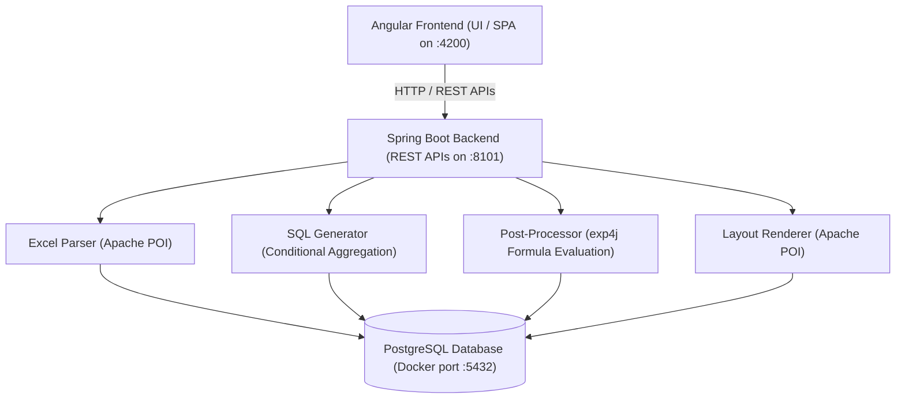

# Reporting Engine Back-End

A robust, enterprise-grade, metadata-driven report configuration and execution engine. This repository contains the **Java 17 (Spring Boot v3.2.4) backend** and database migrations. The frontend is split into the [ReportTemplate_FrontEnd](file:///G:/workspace/ReportTemplate_FrontEnd) repository.

The backend ingests Excel layout templates, normalizes their configuration into metadata tables, resolves logical metrics against a semantic data model, generates high-performance SQL query structures with conditional aggregation, evaluates math formulas, and renders final styled Excel workbooks using Apache POI.

---

## Repo Metadata

- **Author**: Antigravity Developer Team & Google DeepMind Pair Programmer
- **Repository**: [ReportTemplate_BackEnd](file:///G:/workspace/ReportTemplate_BackEnd)
- **Backend Stack**: Java 17, Spring Boot 3.2.4, Spring Data JPA, Hibernate, exp4j
- **Database**: PostgreSQL 16 (Local Docker container or Neon Serverless Postgres in production)

---

## Table of Contents

- [Key Project Documentation](#key-project-documentation)
- [Key Links](#key-links)
- [Project Structure](#project-structure)
- [Architecture and Tech Stack - at a Glance](#architecture-and-tech-stack---at-a-glance)
- [Quick Start: Working With This Repo](#quick-start-working-with-this-repo)
    - [Prerequisites](#prerequisites)
    - [One-Time Setup](#one-time-setup)
    - [Per Dev Session](#per-dev-session)
- [Useful Commands](#useful-commands)
- [End-to-End Application Flow](#end-to-end-application-flow)
- [Database Layers](#database-layers)

---

## Key Project Documentation

| Document                                                                           | Description                                                                |
| :--------------------------------------------------------------------------------- | :------------------------------------------------------------------------- |
| [README.md](README.md)                                                             | This file - the developer front door                                       |
| [TODO.md](TODO.md)                                                                 | Project plan, completed milestones, and development backlog                |
| [docs/DESIGN.md](docs/DESIGN.md)                                                   | Visual design tokens, color guidelines, and UX guidelines                  |
| [docs/architecture-and-walkthrough.md](docs/architecture-and-walkthrough.md)       | System design decisions (ADRs), solution architecture, and user journeys   |
| [docs/testing.md](docs/testing.md)                                                 | Quality assurance guidelines, testing commands, and manual REST API checks |
| [deployment/README.md](deployment/README.md)                                       | Application packaging, Docker compose guidelines, and CI/CD stages         |
| [.agents/agents/validation_agents.md](.agents/agents/validation_agents.md)         | Back-end validation agents specification and execution guide               |
| [documentation/report_authoring_guide.md](documentation/report_authoring_guide.md) | Business user guide on how to design layout templates in Excel             |
| [documentation/implementation_plan.md](documentation/implementation_plan.md)       | Base implementation plan for platform migration and dynamic filters        |
| [GEMINI.md](GEMINI.md)                                                             | Handoff state, schema layout, API endpoints, and phase 2 roadmap           |

---

## Key Links

- **Spring Boot Backend API**: [http://127.0.0.1:8101](http://127.0.0.1:8101)
- **Angular Frontend UI**: [http://127.0.0.1:4200](http://127.0.0.1:4200)
- **PostgreSQL Database**: `127.0.0.1:5432` (DB: `agentic_ai`, User: `user`, Pass: `password`)

> **Windows note**: Use `127.0.0.1` instead of `localhost` to avoid IPv6 DNS resolution delay (saves 1–2 s per request on Windows).

---

## Project Structure

```text
ReportTemplate_BackEnd/
├── .agents/                    # ADK validation agents configuration & code
│   ├── agents/                 # Validator specifications
│   └── validation/             # Executable validation agent (agent.py, tools.py)
├── db/                         # Database container configuration
│   ├── migrations/             # SQL migration scripts (000 to 008)
│   └── Dockerfile              # Custom Postgres image bundling migrations
├── src/                        # Spring Boot Java application source code
│   ├── main/
│   │   ├── java/com/reporting/
│   │   │   ├── Application.java # Bootloader application class
+   │   │   ├── config/         # Security & CORS settings
+   │   │   ├── controller/     # REST Endpoints (Auth, Reports)
+   │   │   ├── domain/         # JPA Entities (rpt_* tables)
+   │   │   ├── dto/            # Data Transfer Objects
+   │   │   ├── repository/     # Data repositories
+   │   │   ├── service/        # Core services (Parser, SQL, POI, formulas)
+   │   │   └── util/           # MigrationRunner, DbDumper utilities
│   │   └── resources/
│   │       └── application.properties # Server and datasource config
├── documentation/              # Design plans and authoring guides
├── maven/                      # Embedded Apache Maven 3.9.6 wrapper
├── docker-compose.yml          # Container composition orchestration
├── pom.xml                     # Maven POM dependencies build script
└── GEMINI.md                   # State handoff and database schema reference
```

---

## Architecture and Tech Stack - at a Glance

The architecture is built for clean separation of concerns:

### Unified Architecture View

```text
                       ┌─────────────────────────┐
                       │   Angular Frontend      │
                       │   (UI / SPA on :4200)   │
                       └────────────┬────────────┘
                                    │ HTTP / REST APIs
                                    ▼
                       ┌─────────────────────────┐
                       │   Spring Boot Backend   │
                       │   (REST APIs on :8101)  │
                       └────────────┬────────────┘
                                    │
         ┌──────────────────────────┼──────────────────────────┐
         ▼                          ▼                          ▼
┌─────────────────┐        ┌──────────────────┐       ┌──────────────────┐
│  Excel Parser   │        │  SQL Generator   │       │  Post-Processor  │
│  (Apache POI)   │        │  (Conditional    │       │  (exp4j Formula  │
│                 │        │  Aggregation)    │       │  Evaluation)     │
└────────┬────────┘        └────────┬─────────┘       └────────┬─────────┘
         │                          │                          │
         └──────────────────────────┼──────────────────────────┘
                                    ▼
                       ┌─────────────────────────┐
                       │    PostgreSQL Container │
                       │    (Docker port :5432)  │
                       └─────────────────────────┘
```

### Visual Component Dependency Flow (Mermaid)



### Backend Components (Java)

All core services are located in [src/main/java/com/reporting/service/](file:///G:/workspace/ReportTemplate_BackEnd/src/main/java/com/reporting/service/):

- **[ExcelParserService.java](file:///G:/workspace/ReportTemplate_BackEnd/src/main/java/com/reporting/service/ExcelParserService.java)**: Parses the user-defined Excel layout workbook using **Apache POI**, extracts layout variables, and persists configuration records in a database transaction.
- **[SqlGeneratorService.java](file:///G:/workspace/ReportTemplate_BackEnd/src/main/java/com/reporting/service/SqlGeneratorService.java)**: Builds dynamic, highly-optimized SQL queries using CTE structures and conditional aggregations mapped against time-intelligence intervals (MTD, YTD, WEEK, ROLLING).
- **[PostProcessorService.java](file:///G:/workspace/ReportTemplate_BackEnd/src/main/java/com/reporting/service/PostProcessorService.java)**: Evaluates horizontal `CALC` columns and vertical `calc` math formulas on query results using **exp4j**.
- **[LayoutRendererService.java](file:///G:/workspace/ReportTemplate_BackEnd/src/main/java/com/reporting/service/LayoutRendererService.java)**: Outputs the final results back to `.xlsx` sheets with grid formatting, indentation levels, currency styles, and headers using **Apache POI**.
- **[ReportRunnerService.java](file:///G:/workspace/ReportTemplate_BackEnd/src/main/java/com/reporting/service/ReportRunnerService.java)**: Orchestrates the execution sequence.

---

## Quick Start: Working With This Repo

Follow these steps to run the Reporting Engine backend locally:

### Prerequisites

Ensure you have the following installed on your machine:

- **Docker & Docker Compose**: To run the PostgreSQL database.
- **Java Development Kit (JDK) 17**: Required for building and running the backend.
- **Python (v3.10+)**: Required for running the ADK validation agent.

### One-Time Setup

1. **Spin up the Database Container**:
   Build the custom database image containing the pre-seeded SQL migrations and start it:

    ```bash
    docker-compose down -v
    docker-compose up --build -d
    ```

    _Note: This will expose PostgreSQL on port `5432` with database `agentic_ai`._

2. **Initialize ADK Validation Environment**:
   Ensure `google-adk` is installed:
    ```bash
    pip install google-adk
    ```

### Per Dev Session

1. **Start the Java Backend**:
   Clean compile and launch the Spring Boot application server on port `8101` using the embedded Maven wrapper:
    - **On Windows (PowerShell/Cmd)**:
        ```cmd
        maven\apache-maven-3.9.6\bin\mvn.cmd clean compile
        maven\apache-maven-3.9.6\bin\mvn.cmd spring-boot:run
        ```
    - **On macOS/Linux**:
        ```bash
        ./maven/apache-maven-3.9.6/bin/mvn clean compile
        ./maven/apache-maven-3.9.6/bin/mvn spring-boot:run
        ```

2. **Run ADK Validation Agent**:
   To validate backend changes (compiling, running JUnit tests, and checking code quality/security):
    ```bash
    adk run .agents/validation
    ```
    Prompt the agent with: `"Validate the codebase changes"` or `"Audit code and run tests"`.

---

## Useful Commands

Below is a summary of the most useful commands for building and running the backend components:

| Category     | Command                                                | Target/CWD   | Description                                                    |
| :----------- | :----------------------------------------------------- | :----------- | :------------------------------------------------------------- |
| **Database** | `docker-compose up --build -d`                         | Project Root | Builds and starts database container in detached mode          |
| **Database** | `docker-compose down -v`                               | Project Root | Stops the database container and deletes the persistent volume |
| **Backend**  | `maven\apache-maven-3.9.6\bin\mvn.cmd clean compile`   | Project Root | Clean compile Spring Boot application (Windows)                |
| **Backend**  | `maven\apache-maven-3.9.6\bin\mvn.cmd spring-boot:run` | Project Root | Runs the backend server on port 8101 (Windows)                 |
| **Backend**  | `maven\apache-maven-3.9.6\bin\mvn.cmd test`            | Project Root | Runs JUnit unit and integration tests                          |
| **ADK Agent**| `adk run .agents/validation`                           | Project Root | Runs the backend validation agent interactively                |
| **ADK Agent**| `adk web .agents/validation`                           | Project Root | Launches the Web UI to chat/run backend validation tasks       |

---

## End-to-End Application Flow

1. Open **[http://127.0.0.1:4200/](http://127.0.0.1:4200/)** and sign in with the default credentials:
    - **Username**: `admin`
2. Under the catalog screen, select the **Import Template** option and upload **`hybrid_reporting_template.xlsx`** (or a similar layout).
3. The backend will parse the workbook and insert metadata definitions into PostgreSQL.
4. Click on the imported report (e.g. `SALES_OVERVIEW` or `INVESTMENT_SUMMARY`), select a Reference Date (e.g. `2025-12-31`), and click **Run**.
5. The backend will dynamically fetch values, evaluate formulas, apply styles, and compile a `.xlsx` report file for direct download.
6. Browse the **Semantic Layer** tab to inspect DWH schema explore paths, joins, logical view mappings, dimensions, and measures.

---

## Database Layers

The PostgreSQL instance manages two schemas in the `agentic_ai` database:

- **`reporting.*`**: Stores metadata, report definitions, explores, views, dimension/measure columns, join paths, and import audit history.
- **`analytics.*`**: Represents the physical Data Warehouse (DWH) containing dimension and fact tables (seeding transaction, performance, investment, and sales data for 2024–2026).
