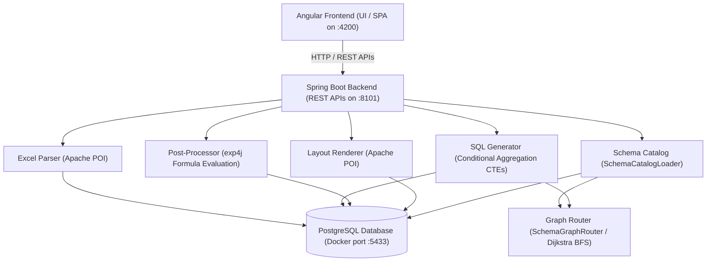

# Reporting Engine Back-End — Enterprise Developer Guide

A robust, enterprise-grade, metadata-driven report configuration and execution engine. This repository contains the **Java 21 (Spring Boot v3.5.0-SNAPSHOT) backend** and PostgreSQL database migrations. The frontend is split into the [reportingengine_frontend](../reportingengine_frontend) repository.

The backend ingests Excel layout templates, normalizes their configuration into metadata tables, resolves logical metrics against a semantic data model, generates high-performance SQL query structures with conditional aggregation, evaluates math formulas, and renders final styled Excel workbooks.

---

## Repo Metadata

- **Author**: Antigravity Developer Team & Google DeepMind Pair Programmer
- **Repository**: [reportingengine_backend](./)
- **Backend Stack**: Java 21, Spring Boot 3.5.0-SNAPSHOT, Spring Data JPA, Hibernate, exp4j, Project Loom Virtual Threads
- **Database**: PostgreSQL 18 (Local Docker container or Neon Serverless Postgres in production)

---

## Table of Contents

- [Reporting Engine Back-End — Enterprise Developer Guide](#reporting-engine-back-end--enterprise-developer-guide)
  - [Repo Metadata](#repo-metadata)
  - [Table of Contents](#table-of-contents)
  - [Key Project Documentation](#key-project-documentation)
  - [Key Links](#key-links)
  - [Project Structure](#project-structure)
  - [Architectural Stack \& Key Optimizations](#architectural-stack--key-optimizations)
    - [Core Technologies](#core-technologies)
    - [Column Time-Window Types \& Period Boundaries](#column-time-window-types--period-boundaries)
  - [Architecture Diagram](#architecture-diagram)
  - [Quick Start: Working With This Repo](#quick-start-working-with-this-repo)
    - [1. Environment Variables](#1-environment-variables)
    - [Per Dev Session](#per-dev-session)
  - [Useful Commands](#useful-commands)
  - [End-to-End Application Flow](#end-to-end-application-flow)
  - [Database Layers](#database-layers)
  - [Troubleshooting Port Conflicts](#troubleshooting-port-conflicts)
    - [1. Identify Running Processes](#1-identify-running-processes)
    - [2. Kill the Process Manually](#2-kill-the-process-manually)

---

## Key Project Documentation

| Document | Description |
| :--- | :--- |
| [README.md](README.md) | This file - the developer front door |
| [TODO.md](TODO.md) | Project plan, completed milestones, and development backlog |
| [docs/DESIGN.md](docs/DESIGN.md) | Visual design tokens, color guidelines, and UX guidelines |
| [docs/architecture-and-walkthrough.md](docs/architecture-and-walkthrough.md) | System design decisions (ADRs), solution architecture, and user journeys |
| [docs/testing.md](docs/testing.md) | Quality assurance guidelines, testing commands, and manual REST API checks |
| [docs/swagger-spec.yaml](docs/swagger-spec.yaml) | API Swagger Specification - complete OpenAPI 3.0.3 REST endpoints contract |
| [deployment/README.md](deployment/README.md) | Application packaging, Docker compose guidelines, and CI/CD stages |
| [.agents/agents/validation_agents.md](.agents/agents/validation_agents.md) | Back-end validation agents specification and execution guide |
| [docs/regional_distribution_template.md](docs/regional_distribution_template.md) | Detailed configuration reference for the Regional Distribution template |
| [documentation/report_authoring_guide.md](documentation/report_authoring_guide.md) | Business user guide on how to design layout templates in Excel |
| [documentation/implementation_plan.md](documentation/implementation_plan.md) | Base implementation plan for platform migration and dynamic filters |
| [GEMINI.md](GEMINI.md) | Handoff state, schema layout, API endpoints, and phase 2 roadmap |

---

## Key Links

- **Spring Boot Backend API**: [http://127.0.0.1:8101](http://127.0.0.1:8101)
- **Angular Frontend UI**: [http://127.0.0.1:4200](http://127.0.0.1:4200)
- **API Swagger Specification**: [docs/swagger-spec.yaml](docs/swagger-spec.yaml)
- **PostgreSQL Database**: `127.0.0.1:5433` (DB: `reporting_db`, User: `user`, Pass: `*****` - maps to container port `5432`)

> **Windows/macOS Performance Note**: Use `127.0.0.1` instead of `localhost` to avoid IPv6 DNS resolution delay (saves 1–2 s per request on Windows).

---

## Project Structure

```text
reportingengine_backend/
├── docs/                       # Architecture, data model, and testing docs
├── src/                        # Spring Boot Java application source code
│   ├── main/
│   │   ├── java/com/db/reporting/
│   │   │   ├── Application.java          # Bootloader application class
│   │   │   ├── cache/                    # In-memory startup caches
│   │   │   │   └── MetadataCache.java    # Pre-loads DWH schema catalogs, views & measures
│   │   │   ├── catalog/                  # Schema catalog & graph router
│   │   │   │   ├── SchemaCatalogLoader.java  # Loads meta_* tables into in-memory graph
│   │   │   │   ├── SchemaGraphRouter.java    # Dijkstra BFS join path resolver
│   │   │   │   ├── MetaTable.java
│   │   │   │   ├── MetaColumn.java
│   │   │   │   └── MetaRelationship.java
│   │   │   ├── config/                   # Security & CORS settings
│   │   │   ├── controller/               # REST Endpoints
│   │   │   │   ├── AuthController.java
│   │   │   │   ├── ColumnFilterCacheController.java # Pre-cached filter value REST endpoints
│   │   │   │   ├── GlobalExceptionHandler.java
│   │   │   │   ├── MetadataController.java
│   │   │   │   ├── ReportCloneController.java       # Clones report configurations REST endpoints
│   │   │   │   ├── ReportController.java     # CRUD, validation, and multi-format run
│   │   │   │   ├── ReportExecutionController.java # Live unpivoted query runs
│   │   │   │   ├── ReportPreviewController.java
│   │   │   │   ├── ReportVersionController.java   # HTTP adapter for versioning actions
│   │   │   │   └── SchemaDiscoveryController.java # DWH table and column autocomplete
│   │   │   ├── domain/                   # JPA Entities (rpt_* tables)
│   │   │   ├── dto/                      # Data Transfer Objects
│   │   │   ├── exception/                # Custom exception types
│   │   │   ├── filter/                   # HTTP Filters
│   │   │   │   └── CorrelationIdFilter.java # Injects MDC with request X-Correlation-ID
│   │   │   ├── repository/               # Spring Data repositories
│   │   │   ├── service/                  # Core services (Parser, SQL, POI, formulas)
│   │   │   │   ├── AnalyticsQueryDispatcher.java # Routes SQL queries between PostgreSQL and BigQuery
│   │   │   │   ├── BigQueryAnalyticsService.java # Runs analytical queries over BigQuery SDK
│   │   │   │   ├── ColumnFilterCacheService.java # Caches filter dropdown options via Caffeine
│   │   │   │   ├── FilterCompilerService.java # Compiles row filters into AST and SQL
│   │   │   │   ├── FilterNode.java       # AST Sealed interface type
│   │   │   │   ├── RuleNode.java         # AST Record for terminal rule
│   │   │   │   ├── GroupNode.java        # AST Record for logical group
│   │   │   │   ├── LayoutRendererService.java # Renders styled Excel layouts
│   │   │   │   ├── PostgresExcelStreamService.java # Streaming Excel exporter using SXSSF
│   │   │   │   ├── ReportCloneService.java # Clones report definitions
│   │   │   │   ├── ReportConfigService.java  # CRUD & config loading via fast JDBC read
│   │   │   │   ├── ReportRunnerService.java  # Orchestrates load -> execute -> render pipeline
│   │   │   │   ├── ReportValidationService.java # Schema expression and cyclic checks
│   │   │   │   ├── SecurityContextService.java # Ingests OAuth2 JWT token claims
│   │   │   │   ├── SqlGeneratorService.java  # Compiles dynamic CTE queries
│   │   │   │   └── VersioningService.java # Business rules for version state and auto-forking
│   │   │   └── util/                     # MigrationRunner, DbDumper utilities
│   │   └── resources/
│   │       └── application.properties    # Server and datasource config
│   └── test/                             # JUnit unit & integration tests
├── maven/                      # Embedded Apache Maven 3.9.6 wrapper
├── docker-compose.yml          # Container composition orchestration
├── pom.xml                     # Maven POM dependencies build script
└── GEMINI.md                   # State handoff and database schema reference
```

---

## Architectural Stack & Key Optimizations

The backend is architected as a high-performance Spring Boot application prioritizing low-latency reads, structured data layers, and safe mathematical evaluation.

### Core Technologies

*   **Java Runtime:** Java 21 (LTS)
*   **Framework:** Spring Boot v3.5.0-SNAPSHOT
*   **Virtual Threads:** Enabled via `spring.threads.virtual.enabled=true` to handle Tomcat HTTP request processing and task execution on Project Loom virtual threads.
*   **Persistence:** Spring Data JPA (Hibernate v6.x) for configuration CRUD operations.
*   **Sealed AST Filter Compiler:** Uses a modern pattern matching compiler (`FilterCompilerService`) with sealed hierarchy (`FilterNode`) and Java 21 records (`RuleNode`, `GroupNode`) to compile row-level filter expressions.
*   **In-Memory Metadata Cache:** Startup-loaded `MetadataCache` pre-fetches column definitions, time keys, semantic measures, and views, reducing report compilation latency to ~50ms by eliminating live `information_schema` query overhead.
*   **Autocomplete Cache (Caffeine):** Pre-caches distinct filter values via `ColumnFilterCacheService` to achieve <5ms autocomplete dropdown rendering latencies.
*   **Direct JDBC Optimization:** Direct JDBC Template with `RowCallbackHandler` bypassing Hibernate hydration for the critical read hot-path (`loadFromDb()`). This optimization reduces report configuration latency from ~163ms to ~59ms.
*   **Direct JDBC Save Path:** Report row/column configurations are persisted using direct `JdbcTemplate` updates in `ReportConfigService`, resolving Hibernate cascade overhead and preventing orphan rows.
*   **Pushed-Down SQL Filters:** Pushes general and quick filters into the individual fact table CTEs inside `SqlGeneratorService`, allowing PostgreSQL to optimize execution plans by filtering early during the scan.
*   **Request Trace Correlation:** `CorrelationIdFilter` stamps every incoming request and downstream log entry with a request-scoped `X-Correlation-ID` header, facilitating distributed tracing in Cloud Run.
*   **Hybrid Analytics Query Routing:** Executes local PostgreSQL queries under `dev` profile and compiles/executes GoogleSQL dialect queries over the BigQuery client SDK under `sit` profile (managed by `AnalyticsQueryDispatcher`).
*   **Multi-Format Export Engine:** Supports Excel (Apache POI), PDF (OpenPDF / `com.lowagie.text`), and CSV exports.
*   **Low-Memory Excel Streaming:** Bypasses heap constraints for large files (100k+ rows) by using Apache POI `SXSSFWorkbook` to stream PostgreSQL database cursor records into compressed temp files (managed by `PostgresExcelStreamService`).
*   **OAuth2 Resource Server:** Upgraded security layer using JWT tokens with `SecurityContextService` extracting custom user claims.
*   **Database:** PostgreSQL 18 (Local Docker container on port `5433` and Neon Serverless Postgres in production).

### Column Time-Window Types & Period Boundaries

The engine resolves dynamic column time boundaries in `DateUtils` according to the following configurations:
*   **`WTD` (Week-to-Date):** Monday–Sunday window.
*   **`MTD` (Month-to-Date):** Beginning of the month to reporting date.
*   **`QTD` (Quarter-to-Date):** Beginning of the quarter (Q1: Jan 1, Q2: Apr 1, Q3: Jul 1, Q4: Oct 1) to reporting date.
*   **`YTD` (Year-to-Date):** January 1st to reporting date.

**Immutability & Expansion Rules for Past Periods:**
For all current periods (period offset = 0), the end boundary is locked to the reporting date (e.g. current day). For all past/future periods (period offset $\neq$ 0), the boundary automatically expands to cover the **entire period** (e.g. full month or quarter) rather than truncating to the day-of-period of the reporting date.

---

## Architecture Diagram

The architecture is built for clean separation of concerns:


```mermaid
flowchart TD
    A["Angular Frontend (UI / SPA on :4200)"] -->|HTTP / REST APIs| B["Spring Boot Backend (REST APIs on :8101)"]
    B --> C["Excel Parser (Apache POI)"]
    B --> D["SQL Generator (Conditional Aggregation CTEs)"]
    B --> E["Post-Processor (exp4j Formula Evaluation)"]
    B --> F["Layout Renderer (Apache POI)"]
    B --> H["Schema Catalog (SchemaCatalogLoader)"]
    H --> I["Graph Router (SchemaGraphRouter / Dijkstra BFS)"]
    D --> I
    C --> G[("PostgreSQL Database (Docker port :5433)")]
    D --> G
    E --> G
    F --> G
    H --> G
```

---

## Quick Start: Working With This Repo

Follow these steps to run the Reporting Engine backend locally:

### 1. Environment Variables

The backend requires the following environment variables to be defined (either in your environment or via a `.env` file):

| Variable | Description | Default / Example Value |
| :--- | :--- | :--- |
| `DB_CATALOG_SCHEMA` | Schema name for graph catalog metadata | `catalog_owner` |
| `DB_REPORT_BUILDER_SCHEMA` | Schema name for report builder definitions | `report_builder_owner` |
| `BIGQUERY_DATASET` | BigQuery analytics dataset name | `<<your_bq_dataset>>` |
| `SPRING_DATASOURCE_URL` | PostgreSQL JDBC connection URL | `jdbc:postgresql://127.0.0.1:5433/reporting_db` |
| `SPRING_DATASOURCE_USERNAME` | Database connection username | `<<your_db_username>>` |
| `SPRING_DATASOURCE_PASSWORD` | Database connection password | `<<your_db_password>>` |
| `GCP_PROJECT_ID` | GCP Project ID (for SIT profile BigQuery calls) | `your-gcp-project-id` |

```properties
# Example .env configuration
DB_CATALOG_SCHEMA=catalog_owner
DB_REPORT_BUILDER_SCHEMA=report_builder_owner
BIGQUERY_DATASET=analytics
SPRING_DATASOURCE_URL=jdbc:postgresql://127.0.0.1:5433/reporting_db
SPRING_DATASOURCE_USERNAME=<<your_db_username>>
SPRING_DATASOURCE_PASSWORD=<<your_db_password>>

```

### Per Dev Session

1. **Start the Java Backend**:
   Clean compile and launch the Spring Boot application server on port `8101` using the embedded Maven wrapper:
   - **On Windows (PowerShell/Cmd)**:
     ```cmd
     maven\apache-maven-3.9.6\bin\mvn.cmd clean compile
     maven\apache-maven-3.9.6\bin\mvn.cmd spring-boot:run
     ```
   - **On macOS/Linux**:
     ```bash
     ./maven/apache-maven-3.9.6/bin/mvn clean compile
     ./maven/apache-maven-3.9.6/bin/mvn spring-boot:run
     ```

---

## Useful Commands

Below is a summary of the most useful commands for building and running the backend components:

| Category | Command | Target/CWD | Description |
| :--- | :--- | :--- | :--- |
| **Backend** | `maven\apache-maven-3.9.6\bin\mvn.cmd clean compile` | Project Root | Clean compile Spring Boot application (Windows) |
| **Backend** | `./maven/apache-maven-3.9.6/bin/mvn clean compile` | Project Root | Clean compile Spring Boot application (macOS/Linux) |
| **Backend** | `maven\apache-maven-3.9.6\bin\mvn.cmd spring-boot:run` | Project Root | Runs the backend server on port 8101 (Windows) |
| **Backend** | `./maven/apache-maven-3.9.6/bin/mvn spring-boot:run` | Project Root | Runs the backend server on port 8101 (macOS/Linux) |
| **Backend** | `maven\apache-maven-3.9.6\bin\mvn.cmd test` | Project Root | Runs JUnit unit and integration tests (Windows) |
| **Backend** | `./maven/apache-maven-3.9.6/bin/mvn test` | Project Root | Runs JUnit unit and integration tests (macOS/Linux) |

---

## End-to-End Application Flow

1. Open **[http://127.0.0.1:4200/](http://127.0.0.1:4200/)** and sign in with the default credentials:
    - **Username**: `admin`
2. Under the catalog screen, select the **Import Template** option and upload **`hybrid_reporting_template.xlsx`** (or a similar layout).
3. The backend will parse the workbook and insert metadata definitions into PostgreSQL.
4. Click on the imported report (e.g. `SALES_OVERVIEW` or `INVESTMENT_SUMMARY`), select a Reference Date (e.g. `2025-12-31`), and click **Run**.
5. The backend will dynamically fetch values, evaluate formulas, apply styles, and compile a `.xlsx` report file for direct download.
6. Browse the **Semantic Layer** tab to inspect DWH schema explore paths, joins, logical view mappings, dimensions, and measures.

---

## Database Layers

The PostgreSQL instance manages two schemas in the `reporting_db` database:

- **`report_builder_owner.*`**: Stores report template layouts (headers, columns, rows, metrics, formulas, style formats, and coordinates).
- **`catalog_owner.*`**: Stores the metadata schema registry (physical table configurations, columns, visible/filterable flags, and Dijkstra-weighted join pathways).

---

## Troubleshooting Port Conflicts

When running the application locally, you may encounter port conflicts if the processes are not terminated cleanly (e.g., when a terminal session is closed without stopping the servers).

### 1. Identify Running Processes

To find which process is listening on a specific port:

* **macOS / Linux**:
  ```bash
  lsof -i :8101   # For backend (Port 8101)
  lsof -i :4200   # For frontend (Port 4200)
  ```
  This will print a list of running processes. Look for the `PID` column.

* **Windows**:
  ```powershell
  netstat -ano | findstr :8101
  netstat -ano | findstr :4200
  ```
  The last column in the output represents the process ID (`PID`).

### 2. Kill the Process Manually

Once you have identified the process ID (`PID`):

* **macOS / Linux**:
  ```bash
  kill -9 <PID>
  ```

* **Windows**:
  ```powershell
  taskkill /PID <PID> /F
  ```

