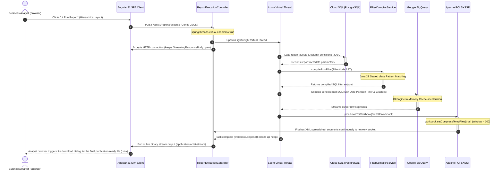

# 📊 Metadata-Driven Report Builder - TO-BE Target Architecture

This document describes the Target C4 Component Architecture and Sequential Flow Lifecycle optimized for high-concurrency scaling up to 30,000 active analysts.

---

## 1. Target Component Architecture Diagram (C4 Component Model)

This diagram details the deep target infrastructure topology on GCP, separating transactional relational metadata (Cloud SQL) from the analytics data warehouse (BigQuery + BI Engine).

```mermaid
graph TB
    %% Client & Ingress Tiers
    subgraph IngressTier ["GCP Edge & Ingress Routing"]
        Analyst["Business Analyst (Browser)"]
        CloudDNS["Google Cloud DNS"]
        CloudArmor["Google Cloud Armor (WAF / DDoS protection)"]
        GCP_LB["Google Cloud Load Balancing (HTTPS)"]
        GCS_Bucket["Google Cloud Storage (GCS)<br>Host: Angular Standalone App assets"]
    end

    %% Security & Config
    subgraph SecurityTier ["Identity, Security, & Credentials"]
        SecretManager["Google Secret Manager<br>(Postgres Credentials / App Configs)"]
        CloudIAM["Google Cloud IAM<br>(Service Accounts & Roles)"]
    end

    %% CI/CD & Deploy Pipelines
    subgraph PipelineTier ["CI/CD Build & Container Registry"]
        ArtifactRegistry["GCP Artifact Registry<br>(Docker Container Images)"]
        CloudBuild["Google Cloud Build<br>(Build / Deployment runner)"]
    end

    %% Serverless Compute Tier
    subgraph ComputeTier ["Serverless Runtime (Google Cloud Run)"]
        subgraph RunSvc ["Cloud Run Service: reporting-backend"]
            direction TB
            ServiceSA["Service Account:<br>report-backend-sa"]
            LoomJVM["Java 21 JVM (Spring Boot 3.5)<br>Virtual Threads Enabled"]
            ASTEngine["Pattern Matching AST Compiler"]
            POIExporter["Apache POI SXSSF Streaming Engine"]
        end

        subgraph RunJob ["Cloud Run Job: db-migrator"]
            direction TB
            JobSA["Service Account:<br>report-migrator-sa"]
            LiquibaseRunner["Liquibase Migration Tool<br>(Pure SQL Changesets)"]
        end
    end

    %% Storage & Warehouse Tier
    subgraph StorageTier ["Target Dual-Database Storage Topology"]
        subgraph CloudSQL ["Google Cloud SQL for PostgreSQL"]
            PostgresDB[("Metadata Database")]
            ReportingSchema["reporting schema<br>[report_column_definitions,<br>global_filter_scopes,<br>user_favorites]"]
        end

        subgraph BigQueryWarehouse ["Google BigQuery Analytics Warehouse"]
            BigQueryDWH[("BigQuery Dataset")]
            AnalyticsSchema["analytics schema<br>[Date Partitions & Clustered Tables]"]
            BIEngine["BI Engine In-Memory Cache"]
        end
    end

    %% Observability Tier
    subgraph MonitorTier ["Google Cloud Observability Suite"]
        CloudLogging["Google Cloud Logging"]
        CloudTrace["Google Cloud Trace (OTel spans)"]
    end

    %% -------------------------------------------------------------------------
    %% Relations & Interaction Flows
    
    %% Ingress Flow
    Analyst -->|"1. Resolves Domain"| CloudDNS
    Analyst -->|"2. HTTPS Request"| CloudArmor
    CloudArmor --> GCP_LB
    GCP_LB -->|"Route Static Assets (*)"| GCS_Bucket
    GCP_LB -->|"Route API Requests (/api/*)"| RunSvc

    %% CI/CD Pipeline Flow
    CloudBuild -->|"Builds & Pushes images"| ArtifactRegistry
    ArtifactRegistry -->|"Pulls Service Image"| RunSvc
    ArtifactRegistry -->|"Pulls Migrator Image"| RunJob
    CloudBuild -->|"Triggers Migrations"| RunJob

    %% Security & Configuration Access
    ServiceSA -->|"Access Secrets via IAM role"| SecretManager
    JobSA -->|"Access Secrets via IAM role"| SecretManager
    SecretManager -->|"Supplies runtime vars (Basic Auth/DB URL)"| LoomJVM
    SecretManager -->|"Supplies migration DB credentials"| LiquibaseRunner

    %% Job Execution
    LiquibaseRunner -->|"Applies schema migrations (JDBC TLS)"| ReportingSchema

    %% Service Execution & Data Flow
    LoomJVM -->|"1. Compiles Row Expressions"| ASTEngine
    LoomJVM -->|"2. Reads report metadata & layout (JDBC)"| ReportingSchema
    LoomJVM -->|"3. Queries analytical tables (BigQuery API)"| AnalyticsSchema
    AnalyticsSchema -->|"4. Fetches cached/clustered rows"| BIEngine
    AnalyticsSchema -->|"Streams query result set"| LoomJVM
    LoomJVM -->|"5. Feeds rows to stream"| POIExporter
    POIExporter -->|"6. Binary stream (StreamingResponseBody)"| GCP_LB

    %% Observability Integration
    LoomJVM -->|"App Logs (Structured JSON)"| CloudLogging
    LoomJVM -->|"Spans (OpenTelemetry)"| CloudTrace

    %% Styling and colors
    classDef client fill:#e1f5fe,stroke:#01579b,stroke-width:2px,color:#01579b;
    classDef ingress fill:#fff3e0,stroke:#e65100,stroke-width:2px,color:#e65100;
    classDef security fill:#ffebee,stroke:#c62828,stroke-width:2px,color:#c62828;
    classDef pipeline fill:#efebe9,stroke:#4e342e,stroke-width:2px,color:#4e342e;
    classDef compute fill:#ede7f6,stroke:#4a148c,stroke-width:2px,color:#4a148c;
    classDef database fill:#e8f5e9,stroke:#1b5e20,stroke-width:2px,color:#1b5e20;
    classDef monitor fill:#eceff1,stroke:#37474f,stroke-width:2px,color:#37474f;

    class Analyst client;
    class CloudDNS,CloudArmor,GCP_LB,GCS_Bucket ingress;
    class SecretManager,CloudIAM security;
    class ArtifactRegistry,CloudBuild pipeline;
    class RunSvc,RunJob,LoomJVM,ASTEngine,POIExporter,LiquibaseRunner compute;
    class PostgresDB,ReportingSchema,BigQueryDWH,AnalyticsSchema,BIEngine database;
    class CloudLogging,CloudTrace monitor;
```

---

## 2. Target End-to-End Sequential Request Lifecycle Diagram

This sequence diagram traces the chronological execution lifecycle of a single report run request from the browser down to BigQuery execution, POI SXSSF caching, and continuous HTTP chunk streaming.

