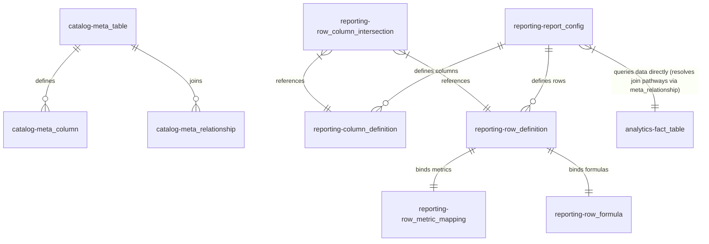

# Data Model Specification & Migration Guide

This document defines the database architecture, schema structures, and relationships for the Reporting Engine. It serves as a blueprint for configuring report templates and registering analytical Data Warehouse (DWH) tables.

---

## 📐 Schema Separation

The platform utilizes three PostgreSQL schemas inside the database to decouple reporting configurations, DWH structures, and metadata explore routing:

1.  **`reporting` Schema**: Stores report templates, style layouts, rows, metrics, formulas, and grid mapping coordinates.
2.  **`catalog` Schema**: Stores the metadata catalog registry of DWH structures ([meta_table](../db/liquibase/sql/002_create_catalog_tables.sql#L9-L19), [meta_column](../db/liquibase/sql/002_create_catalog_tables.sql#L24-L37), and [meta_relationship](../db/liquibase/sql/002_create_catalog_tables.sql#L40-L54)).
3.  **`analytics` Schema**: Represents the actual Data Warehouse (DWH) containing physical facts (e.g., `fact_sales`) and dimensions (e.g., `dim_date`, `dim_location`).



---

## 🗄️ 1. The `catalog` Schema: Schema Registry Catalog

These tables register the physical table structures, columns, and foreign key relationships of the Data Warehouse. At startup, [SchemaCatalogLoader.java](../src/main/java/com/reporting/catalog/SchemaCatalogLoader.java) caches this graph in-memory, and [SchemaGraphRouter.java](../src/main/java/com/reporting/catalog/SchemaGraphRouter.java) executes Dijkstra's BFS to resolve LEFT JOIN chains between facts and dimensions.

#### 1. `catalog.meta_table`

Registers physical tables inside the DWH.
- `table_id` (SERIAL PRIMARY KEY)
- `schema_name` (VARCHAR(63) NOT NULL DEFAULT 'analytics')
- `table_name` (VARCHAR(128) NOT NULL) — physical table name
- `label` (VARCHAR(256)) — UI display name
- `table_type` (VARCHAR(20) NOT NULL CHECK (table_type IN ('fact', 'dimension', 'bridge')))
- `time_key` (VARCHAR(128)) — column name containing the date key (e.g. `'reporting_date'`)
- `is_cached` (BOOLEAN NOT NULL DEFAULT TRUE) — controls if table metadata is cached
- `description` (TEXT)

#### 2. `catalog.meta_column`

Registers physical columns of the tables.
- `column_id` (SERIAL PRIMARY KEY)
- `table_id` (INTEGER REFERENCES `meta_table(table_id) ON DELETE CASCADE`)
- `column_name` (VARCHAR(128) NOT NULL)
- `label` (VARCHAR(256))
- `data_type` (VARCHAR(64))
- `is_primary_key` (BOOLEAN DEFAULT FALSE)
- `is_foreign_key` (BOOLEAN DEFAULT FALSE)
- `is_filterable` (BOOLEAN DEFAULT FALSE) — controls if autocomplete dropdown values are supported
- `is_cached` (BOOLEAN DEFAULT FALSE) — controls if distinct values are pre-loaded into JVM memory at boot
- `is_visible` (BOOLEAN DEFAULT TRUE) — controls if the column is shown in the frontend catalog and builders
- `description` (TEXT)

#### 3. `catalog.meta_relationship`

Defines physical join routes between tables.
- `relationship_id` (SERIAL PRIMARY KEY)
- `from_table_id` (INTEGER REFERENCES `meta_table(table_id) ON DELETE CASCADE`) — source table
- `from_column` (VARCHAR(128) NOT NULL) — source column
- `to_table_id` (INTEGER REFERENCES `meta_table(table_id) ON DELETE CASCADE`) — target table
- `to_column` (VARCHAR(128) NOT NULL) — target column
- `join_type` (VARCHAR(20) DEFAULT 'LEFT' CHECK (join_type IN ('LEFT', 'INNER', 'RIGHT')))
- `is_conformed` (BOOLEAN DEFAULT FALSE)
- `weight` (INTEGER DEFAULT 1) — Dijkstra edge cost (1 = conformed key, 2 = non-conformed FK)
- `description` (TEXT)

---

### 🛡️ Column Behavior Flags: `is_filterable` vs `is_cached` vs `is_visible`

To optimize performance and database load on large Data Warehouses (with potentially billions of rows), the reporting catalog uses three distinct flags on each column:

| Attribute Flag | Meaning / Purpose | How the UI Handles It | Performance & Memory Impact |
| :--- | :--- | :--- | :--- |
| **`is_visible`** | Defines if the column is exposed to the end-user in the builder UI. | If `TRUE`, it is searchable in the sidebar and row/column setup lists. If `FALSE`, it is completely hidden from the builder (typically used for technical PKs/FKs). | None. Hidden columns are still indexed in memory by the runner/validator. |
| **`is_filterable`** | Defines if autocomplete dropdown selection lists are supported for filters. | If `TRUE`, a selectable dropdown of distinct values is shown. If `FALSE` (and not cached), the user must type the value manually. | Triggers an on-demand `SELECT DISTINCT` database query when the user opens the dropdown. |
| **`is_cached`** | Defines if distinct lookup values are preloaded and stored in JVM memory. | If `TRUE`, the autocomplete dropdown loads instantly with no latency. | Zero database hits at runtime. The values are fetched during boot time and consume a small amount of JVM RAM. |

#### Flag Combinations in Action:
*   **Whitelisted Caching (`is_visible=TRUE`, `is_filterable=TRUE`, `is_cached=TRUE`):** Distinct lookup values are pre-loaded at boot and served instantly (0ms) from JVM cache. Ideal for highly frequent, low-cardinality filters (e.g. `segment`, `account_type`).
*   **On-Demand Autocomplete (`is_visible=TRUE`, `is_filterable=TRUE`, `is_cached=FALSE`):** Distinct lookup values are queried from the database on-demand using `SELECT DISTINCT` with limits. Ideal for medium-cardinality filters where we want to save JVM memory.
*   **Manual Filtering (`is_visible=TRUE`, `is_filterable=FALSE`, `is_cached=FALSE`):** User can filter by the column but must manually type the text/numeric value (no dropdown is provided). Autocomplete requests on the database are blocked for security/performance. Ideal for high-cardinality values (e.g., descriptions or numbers).
*   **Fully Hidden (`is_visible=FALSE`):** Invisible to the user interface, but fully accessible to join pathways, formulas, and metric generation.

---

### 🔗 Understanding 'is_conformed' and 'weight' in Catalog Tables

The catalog uses `is_conformed` flags in both column definitions and table relationships to coordinate query routing:

#### 1. `catalog.meta_relationship.is_conformed`
This boolean flag indicates whether a join relationship represents a standard conformed dimension link.
* **Pathfinder Routing Effect:** During SQL compilation, `SchemaGraphRouter` runs Dijkstra's BFS to find the cheapest join chain from the query's fact table to target dimensions. A conformed edge (`is_conformed = true`) is assigned a cost/weight of `1` (or acts as a tie-breaker), ensuring it is always preferred over a non-conformed relationship (which has a cost/weight of `2`).
* **Data Integration:** It defines if the database path should be considered a standard conformed link across the DWH.

#### 2. Overlap between `meta_relationship.is_conformed` and `meta_relationship.weight`
Although all current seed records map `is_conformed = true` directly to `weight = 1` and `is_conformed = false` to `weight = 2`, they serve separate architectural concerns:
* **Separation of Concerns**: `is_conformed` describes **logical business semantics** (whether the join traverses a conformed key), whereas `weight` describes **physical graph routing cost**.
* **Routing Flexibility**: The `SchemaGraphRouter` pathfinder requires a numeric `weight` for Dijkstra's shortest path calculations. Keeping a separate `weight` column allows assigning fine-grained costs (e.g., a weight of `3` or `4` to indicate expensive bridge tables or non-preferred joins), which a simple binary boolean flag cannot support.

---

### 🛑 Troubleshooting Filter Validation: "Filter references unconformed dimension table"

When saving or running a report, you may encounter the validation error:
`Filter references unconformed dimension table 'dim_table'. Valid conformed dimensions for this report layout are: [...]`

#### What causes this error?
1. **The report has no active data rows:** The engine computes the list of valid conformed dimensions by checking the target tables of all **active data rows** in the report. If there are no data rows defined yet (e.g., in a new draft), the valid dimensions list defaults to empty (`[]`), causing filters to fail validation.
2. **Fact tables do not share the dimension:** If your report queries multiple fact tables (e.g., `fact_sales` and `fact_loans`), the engine calculates the *intersection* of their related dimension tables. If they do not share the target dimension table via `meta_relationship`, it is not conformed, and cannot be used in global filters.
3. **Filtering directly on fact tables:** If you try to filter on a fact table (e.g., `fact_investments`) in a global filter, it will fail because fact tables are not dimension tables.

#### How to resolve:
1. Ensure the report has at least one data row mapping to a physical fact table.
2. Verify that the table relationship from your fact table to the dimension table (e.g. `fact_sales` -> `dim_location`) is correctly populated in the `catalog.meta_relationship` table.
3. Use a proper dimension table (like `dim_customers`, `dim_date`, or `dim_location`) in your global and quick filters instead of fact tables.

---

## 🗄️ 2. The `reporting` Schema: Report Template Configurations (Normalized Layouts)

These tables define layouts, columns, row styles, metrics, and active coordinates.

#### 1. `reporting.report_config`

Defines report headers.
- `report_id` (VARCHAR(50)) — alphanumeric identifier (e.g., `'SALES_OVERVIEW'`)
- `version` (INTEGER DEFAULT 1) — version number
- `report_name` (VARCHAR(200) NOT NULL)
- `description` (TEXT)
- `status` (VARCHAR(20) DEFAULT 'draft' CHECK (status IN ('draft', 'in_review', 'published')))
- `source_table` (VARCHAR(150)) — physical fact table scanned (e.g. `'analytics.fact_sales'`)
- `source_field` (VARCHAR(150)) — fallback field mapping
- `granularity` (VARCHAR(1000)) — physical `GROUP BY` column (e.g. `'dim_location.country_name'`)
- `reporting_date_type`        (VARCHAR(16) DEFAULT 'DYNAMIC' CHECK (reporting_date_type IN ('FIXED', 'DYNAMIC')))
- `reporting_date_static`      (DATE)
- `reporting_date_expression`  (VARCHAR(8) DEFAULT 'T-2')
- `timeframe_start_type`       (VARCHAR(16) DEFAULT 'FIXED')
- `timeframe_start_static`     (DATE DEFAULT '2022-01-01')
- `timeframe_start_expression` (VARCHAR(8))
- `timeframe_end_type`         (VARCHAR(16) DEFAULT 'DYNAMIC' CHECK (timeframe_end_type IN ('FIXED', 'DYNAMIC')))
- `timeframe_end_static`       (DATE)
- `timeframe_end_expression`   (VARCHAR(8) DEFAULT 'T-2')
- `quick_filters` (TEXT) — JSON configuration for distinct dropdown values
- `general_filters` (TEXT) — JSON array for push-down fact filter logic
- `deleted` (BOOLEAN DEFAULT FALSE) — soft-delete flag
- **Primary Key**: `(report_id, version)`

#### 2. `reporting.row_style`

Stores cell style attributes.
- `style_id` (SERIAL PRIMARY KEY)
- `name` (VARCHAR(50) NOT NULL UNIQUE) — layout categories (e.g. `'section'`, `'total'`, `'normal'`)
- `font_size` (INTEGER DEFAULT 11)
- `is_bold` (BOOLEAN DEFAULT FALSE)
- `border_top` (BOOLEAN DEFAULT FALSE)
- `border_bottom` (BOOLEAN DEFAULT FALSE)
- `alignment` (VARCHAR(10) CHECK (alignment IN ('left', 'center', 'right')))
- `color_hex` (VARCHAR(7))
- `bg_color_hex` (VARCHAR(7))

#### 3. `reporting.column_definition`

Defines report headers and rolling period configurations.
- `column_def_id` (SERIAL PRIMARY KEY)
- `report_id` (VARCHAR(50))
- `version` (INTEGER)
- `col_id` (VARCHAR(10) NOT NULL) — column grid ID (e.g. `'C1'`)
- `label` (VARCHAR(200))
- `col_type` (VARCHAR(20) CHECK (col_type IN ('WTD', 'MTD', 'YTD', 'ROLLING', 'CALC', 'HEADER')))
- `period_offset` (INTEGER DEFAULT 0) — relative offset (e.g. `0` = current, `-1` = prior period)
- `rolling_n` (INTEGER) — rolling boundary count
- `rolling_grain` (VARCHAR(10) CHECK (rolling_grain IN ('DAY', 'WEEK', 'MONTH', 'YEAR')))
- `formula_expr` (TEXT) — expression for `'CALC'` columns
- `display_order` (INTEGER NOT NULL) — ordering index
- `tier_level` (VARCHAR(10) DEFAULT 'L1' CHECK (tier_level IN ('L1', 'L2', 'L3')))
- `parent_id` (VARCHAR(50))
- **Foreign Key**: `(report_id, version) REFERENCES report_config (report_id, version) ON DELETE CASCADE`
- **Unique Constraint**: `(report_id, version, col_id)`

#### 4. `reporting.row_definition`

Defines layout rows.
- `row_id` (VARCHAR(50) NOT NULL) — row grid ID (e.g. `'R1'`)
- `report_id` (VARCHAR(50))
- `version` (INTEGER)
- `parent_row_id` (VARCHAR(50)) — hierarchical parent reference
- `label` (VARCHAR(300) NOT NULL)
- `row_type` (VARCHAR(20) CHECK (row_type IN ('section', 'data', 'calc', 'blank')))
- `display_order` (INTEGER NOT NULL)
- `indent_level` (INTEGER DEFAULT 0)
- `style_id` (INTEGER REFERENCES `row_style(style_id)`)
- `filter_expr` (TEXT) — row-level DWH custom filters (e.g. `'category = ''Software'''`)
- **Primary Key**: `(report_id, version, row_id)`
- **Foreign Key**: `(report_id, version) REFERENCES report_config (report_id, version) ON DELETE CASCADE`
- **Self-referential FK**: `(report_id, version, parent_row_id) REFERENCES row_definition (report_id, version, row_id) ON DELETE CASCADE`

#### 5. `reporting.row_metric_mapping`

Links `'data'` rows to physical SQL aggregate expressions.
- `row_metric_id` (SERIAL PRIMARY KEY)
- `report_id` (VARCHAR(50))
- `version` (INTEGER)
- `row_id` (VARCHAR(50))
- `sql_expr` (TEXT) — SQL aggregation (e.g. `'SUM(analytics.fact_sales.amount)'`)
- `measure_definition` (TEXT) — metadata JSON
- **Foreign Key**: `(report_id, version, row_id) REFERENCES row_definition (report_id, version, row_id) ON DELETE CASCADE`
- **Unique Constraint**: `(report_id, version, row_id)`

#### 6. `reporting.row_formula`

Links `'calc'` rows to algebraic formulas evaluated via `exp4j`.
- `row_formula_id` (SERIAL PRIMARY KEY)
- `report_id` (VARCHAR(50))
- `version` (INTEGER)
- `row_id` (VARCHAR(50))
- `formula_expr` (TEXT) — algebraic expression (e.g. `'R2 / R3'`)
- **Foreign Key**: `(report_id, version, row_id) REFERENCES row_definition (report_id, version, row_id) ON DELETE CASCADE`
- **Unique Constraint**: `(report_id, version, row_id)`

#### 7. `reporting.row_column_intersection`

Indicates active layout coordinates (grid intersections).
- `mapping_id` (SERIAL PRIMARY KEY)
- `report_id` (VARCHAR(50))
- `version` (INTEGER)
- `row_id` (VARCHAR(50))
- `col_id` (VARCHAR(10))
- `is_enabled` (BOOLEAN DEFAULT TRUE)
- **Foreign Key (Row)**: `(report_id, version, row_id) REFERENCES row_definition (report_id, version, row_id) ON DELETE CASCADE`
- **Foreign Key (Col)**: `(report_id, version, col_id) REFERENCES column_definition (report_id, version, col_id) ON DELETE CASCADE`
- **Unique Constraint**: `(report_id, version, row_id, col_id)`

---

## 🚀 Blueprint for Migrating to a New Data Model

Follow this three-step blueprint when registering new DWH tables (e.g. `analytics.fact_inventory`) and setting up report template structures to support execution:

### Step 1: Create the Analytics Tables (`analytics` schema)

Define the physical fact table containing a partition-key date column and key dimension links:

```sql
CREATE TABLE analytics.fact_inventory (
    id            SERIAL PRIMARY KEY,
    reporting_date DATE NOT NULL,  -- partition key
    warehouse_id  INTEGER NOT NULL,
    supplier_id   INTEGER NOT NULL,
    stock_qty     INTEGER NOT NULL,
    unit_cost     NUMERIC(15,2) NOT NULL
);
```

### Step 2: Populate the Metadata Catalog (`catalog` schema)

Register the metadata catalog configurations to allow `SchemaGraphRouter` to discover relationships and build dynamic SQL joins:

```sql
-- 1. Register the Table
INSERT INTO catalog.meta_table (schema_name, table_name, label, table_type, time_key, description)
VALUES ('analytics', 'fact_inventory', 'Inventory Fact', 'fact', 'reporting_date', 'Inventory level counts');

-- 2. Register columns
INSERT INTO catalog.meta_column (table_id, column_name, label, data_type, is_primary_key, is_foreign_key)
VALUES 
  ((SELECT table_id FROM catalog.meta_table WHERE table_name = 'fact_inventory'), 'id', 'ID', 'integer', TRUE, FALSE),
  ((SELECT table_id FROM catalog.meta_table WHERE table_name = 'fact_inventory'), 'reporting_date', 'Date', 'date', FALSE, TRUE),
  ((SELECT table_id FROM catalog.meta_table WHERE table_name = 'fact_inventory'), 'warehouse_id', 'Warehouse ID', 'integer', FALSE, TRUE);

-- 3. Register relationships (joins)
INSERT INTO catalog.meta_relationship (from_table_id, from_column, to_table_id, to_column, join_type, weight)
VALUES (
    (SELECT table_id FROM catalog.meta_table WHERE table_name = 'fact_inventory'),
    'warehouse_id',
    (SELECT table_id FROM catalog.meta_table WHERE table_name = 'dim_location'),
    'id',
    'LEFT',
    1
);
```

### Step 3: Populate the Report Template Configuration

Now insert the configuration template mapping directly to the physical facts:

```sql
-- 1. Insert Report Header
INSERT INTO reporting.report_config (report_id, report_name, version, status, source_table, granularity)
VALUES ('INV_STATUS', 'Warehouse Inventory Status', 1, 'published', 'analytics.fact_inventory', 'dim_location.country_name');

-- 2. Define Columns (C1 = Current Week, C2 = Prior Week)
INSERT INTO reporting.column_definition (report_id, col_id, label, col_type, period_offset, display_order)
VALUES 
  ('INV_STATUS', 'C1', 'Current Week', 'WTD', 0, 1),
  ('INV_STATUS', 'C2', 'Prior Week', 'WTD', -1, 2);

-- 3. Define Rows
INSERT INTO reporting.row_definition (report_id, row_id, label, row_type, display_order, indent_level)
VALUES 
  ('INV_STATUS', 'R1', 'INVENTORY REPORT', 'section', 1, 0),
  ('INV_STATUS', 'R2', 'Stock Quantity On Hand', 'data', 2, 1),
  ('INV_STATUS', 'R3', 'Average Unit Cost', 'data', 3, 1),
  ('INV_STATUS', 'R4', 'Total Value on Hand', 'calc', 4, 1);

-- 5. Map Data Rows to physical aggregates
INSERT INTO reporting.row_metric_mapping (report_id, row_id, sql_expr)
VALUES 
  ('INV_STATUS', 'R2', 'SUM(analytics.fact_inventory.stock_qty)'),
  ('INV_STATUS', 'R3', 'AVG(analytics.fact_inventory.unit_cost)');

-- 6. Map Calc Row to algebra
INSERT INTO reporting.row_formula (report_id, row_id, formula_expr)
VALUES ('INV_STATUS', 'R4', 'R2 * R3');

-- 7. Enable the grid cells mapping
INSERT INTO reporting.row_column_intersection (report_id, row_id, col_id, is_enabled)
VALUES 
  ('INV_STATUS', 'R2', 'C1', TRUE),
  ('INV_STATUS', 'R2', 'C2', TRUE),
  ('INV_STATUS', 'R3', 'C1', TRUE),
  ('INV_STATUS', 'R3', 'C2', TRUE),
  ('INV_STATUS', 'R4', 'C1', TRUE),
  ('INV_STATUS', 'R4', 'C2', TRUE);
```
Once seeded, report generation compiles inventory statistics instantly without needing backend code updates.
