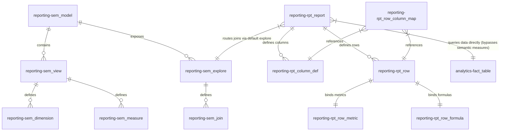

# Data Model Specification & Migration Guide

This document defines the database architecture, schema structures, and relationships for the Reporting Engine, and outlines the blueprint for migrating or populating the database for a new analytical data model.

---

## 📐 Schema Separation

The platform utilizes two PostgreSQL schemas inside the database to decouple reporting configurations from the analytical Data Warehouse (DWH):

1. **`reporting` Schema**: Stores the report configuration metadata, style definitions, cell-level mappings, and the semantic model representing DWH relations (explores, views, and joins).
2. **`analytics` Schema**: Represents the actual Data Warehouse (DWH) containing physical facts (e.g., `fact_sales`) and dimensions (e.g., `dim_date`, `dim_location`).



---

## 🗄️ 1. The `reporting` Schema: Semantic & Configuration Tables

### A. Semantic Metadata Layer (Decoupled Model Description)
These tables store structural information about the Data Warehouse (tables, joins, primary/foreign keys). While the query execution engine bypasses lookups to semantic measures, **dimension joins are still resolved using this layer**.

#### 1. `reporting.sem_model`
Registers top-level models (e.g. LookML equivalent).
- `model_id` (SERIAL PRIMARY KEY)
- `name` (VARCHAR(100) UNIQUE) — e.g., `"sales_analytics"`
- `label` (VARCHAR(200)) — display name
- `is_active` (BOOLEAN DEFAULT TRUE)

#### 2. `reporting.sem_view`
Registers physical tables inside the `analytics` schema.
- `view_id` (SERIAL PRIMARY KEY)
- `model_id` (INTEGER REFERENCES `sem_model`)
- `name` (VARCHAR(100)) — logical view name (e.g., `"dim_location"`)
- `table_ref` (VARCHAR(300)) — fully qualified table (e.g., `"analytics.dim_location"`)
- `view_type` (VARCHAR(20)) — `"fact"` or `"dimension"`
- `primary_key` (VARCHAR(100)) — column acting as PK (e.g., `"id"`)
- `time_key` (VARCHAR(100)) — date partition/rolling key (e.g., `"order_date"` for facts)

#### 3. `reporting.sem_explore`
Defines query entry-points driving fact aggregations.
- `explore_id` (SERIAL PRIMARY KEY)
- `model_id` (INTEGER REFERENCES `sem_model`)
- `fact_view_id` (INTEGER REFERENCES `sem_view`)
- `name` (VARCHAR(100)) — logical name (e.g., `"fact_sales"`)
- `sql_always_where` (TEXT) — optional global filter appended to queries

#### 4. `reporting.sem_join`
Specifies relationships between facts and dimensions.
- `join_id` (SERIAL PRIMARY KEY)
- `explore_id` (INTEGER REFERENCES `sem_explore`)
- `from_view_id` (INTEGER REFERENCES `sem_view`) — fact view
- `to_view_id` (INTEGER REFERENCES `sem_view`) — dimension view
- `join_sql` (TEXT) — join condition (e.g., `"analytics.fact_sales.location_id = analytics.dim_location.id"`)
- `join_type` (VARCHAR(10) DEFAULT `"LEFT"`) — `"LEFT"` or `"INNER"`

---

### B. Report Template Configurations (Normalized Schema)
These tables store Excel layout hierarchies, row types, cell activation, and styling.

#### 1. `reporting.rpt_report`
Registers individual reports.
- `report_id` (VARCHAR(50)) — e.g. `"SALES_OVERVIEW"`
- `version` (INTEGER) — version number
- `status` (VARCHAR(50)) — `"draft"` | `"in_review"` | `"published"`
- `deleted` (BOOLEAN) — soft-delete flag (defaults to FALSE)
- `name` (VARCHAR(200)) — e.g. `"Sales & Margin Report"`
- `explore_id` (INTEGER REFERENCES `sem_explore`) — default join routes
- `source_table` (VARCHAR(150)) — physical fact table scanned (e.g. `"analytics.fact_sales"`)
- `granularity` (VARCHAR(1000)) — DWH sub-row grouping key (e.g. `"dim_location.country_name"`)
- `timeframe_start` (VARCHAR(50)) — date timeframe offset start boundary
- `timeframe_end` (VARCHAR(50)) — date timeframe offset end boundary
- `timeframe_today` (BOOLEAN) — flags if timeframe respects current day execution
- `quick_filters` (TEXT) — JSON string for UI dropdown filter limits
- `general_filters` (TEXT) — JSON string of DWH conditions (e.g. `[{"column":"region", "operator":"=", "value":"North"}]`)
- **Primary Key**: `(report_id, version)`

#### 2. `reporting.rpt_column_def`
Defines columns (C1, C2, etc.) and time horizons.
- `column_def_id` (SERIAL PRIMARY KEY)
- `report_id` (VARCHAR(50))
- `version` (INTEGER)
- `col_id` (VARCHAR(10)) — column ID (e.g. `"C1"`)
- `label` (VARCHAR(200)) — header display label
- `col_type` (VARCHAR(20)) — `"WEEK"` | `"MTD"` | `"YTD"` | `"ROLLING"` | `"CALC"`
- `period_offset` (INTEGER DEFAULT 0) — 0 = current period, -1 = prior period
- `rolling_n` (INTEGER) — rolling period count
- `rolling_grain` (VARCHAR(10)) — `"DAY"` | `"WEEK"` | `"MONTH"`
- `formula_expr` (TEXT) — expression for `"CALC"` columns (e.g. `"(C1 - C2) / C2"`)
- `display_order` (INTEGER) — left-to-right rendering order
- **Foreign Key**: `(report_id, version) REFERENCES rpt_report (report_id, version) ON DELETE CASCADE`
- **Unique Constraint**: `(report_id, version, col_id)`

#### 3. `reporting.rpt_row`
Defines rows (labels, hierarchical levels, styling).
- `report_id` (VARCHAR(50))
- `version` (INTEGER)
- `row_id` (VARCHAR(50)) — e.g. `"R1"`
- `parent_row_id` (VARCHAR(50)) — parent row ID
- `label` (VARCHAR(300)) — display text in the output spreadsheet
- `row_type` (VARCHAR(20)) — `"section"` | `"data"` | `"calc"` | `"blank"`
- `display_order` (INTEGER) — top-to-bottom rendering order
- `indent_level` (INTEGER DEFAULT 0) — UI display indent padding
- `style_id` (INTEGER REFERENCES `rpt_style`)
- `filter_expr` (TEXT) — row-level DWH custom filters (e.g., `"category = 'Software'"`)
- **Primary Key**: `(report_id, version, row_id)`
- **Foreign Key**: `(report_id, version) REFERENCES rpt_report (report_id, version) ON DELETE CASCADE`
- **Self-referential FK**: `(report_id, version, parent_row_id) REFERENCES rpt_row (report_id, version, row_id)`

#### 4. `reporting.rpt_row_metric`
Binds `"data"` rows to physical aggregates.
- `row_metric_id` (SERIAL PRIMARY KEY)
- `report_id` (VARCHAR(50))
- `version` (INTEGER)
- `row_id` (VARCHAR(50))
- `sql_expr` (TEXT) — direct aggregate formula (e.g. `"SUM(analytics.fact_sales.amount)"`)
- `measure_definition` (TEXT) — JSON schema details
- **Foreign Key**: `(report_id, version, row_id) REFERENCES rpt_row (report_id, version, row_id) ON DELETE CASCADE`
- **Unique Constraint**: `(report_id, version, row_id, measure_id)`

#### 5. `reporting.rpt_row_formula`
Binds `"calc"` rows to algebraic post-process formula expressions.
- `row_formula_id` (SERIAL PRIMARY KEY)
- `report_id` (VARCHAR(50))
- `version` (INTEGER)
- `row_id` (VARCHAR(50))
- `formula_expr` (TEXT) — row formula (e.g. `"R2 - R3"`)
- **Foreign Key**: `(report_id, version, row_id) REFERENCES rpt_row (report_id, version, row_id) ON DELETE CASCADE`
- **Unique Constraint**: `(report_id, version, row_id)`

#### 6. `reporting.rpt_row_column_map`
Specifies which intersections are active. If an intersection is disabled (`is_enabled = FALSE`), the engine skips query compilation and post-processing for that cell, leaving it empty in the rendered Excel template.
- `report_id` (VARCHAR(50))
- `version` (INTEGER)
- `row_id` (VARCHAR(50))
- `col_id` (VARCHAR(10))
- `is_enabled` (BOOLEAN DEFAULT TRUE)
- **Primary Key**: `(report_id, version, row_id, col_id)`
- **Foreign Key (Row)**: `(report_id, version, row_id) REFERENCES rpt_row (report_id, version, row_id) ON DELETE CASCADE`
- **Foreign Key (Col)**: `(report_id, version, col_id) REFERENCES rpt_column_def (report_id, version, col_id) ON DELETE CASCADE`

---

> [!TIP]
> For a complete, real-world example of a configured report template (including active columns, data rows, custom SQL metrics, and calculated growth formulas), see the **[Regional Distribution Template Reference](regional_distribution_template.md)**.

---

## 🚀 Blueprint for Migrating to a New Data Model

If you add a new fact table to the warehouse (e.g. `analytics.fact_inventory`) and wish to spin up a report template against it, follow these steps:

### Step 1: Create the DWH Tables (`analytics` schema)
Ensure your new fact table contains a time column (used for partitions and rolling limits) and any dimension lookup foreign keys:
```sql
CREATE TABLE analytics.fact_inventory (
    id            SERIAL PRIMARY KEY,
    date_key      DATE NOT NULL,  -- partition key
    warehouse_id  INTEGER NOT NULL,
    supplier_id   INTEGER NOT NULL,
    stock_qty     INTEGER NOT NULL,
    unit_cost     NUMERIC(15,2) NOT NULL
);
```

### Step 2: Populate the Semantic Join Model
Populating these records registers the metadata mapping so the SQL query compiler can dynamically resolve join paths when applying granularity rules:

```sql
-- 1. Register the Model (if not already existing)
INSERT INTO reporting.sem_model (name, label)
VALUES ('inventory_model', 'Inventory Analytics Model')
ON CONFLICT DO NOTHING;

-- 2. Register Views (The Fact and the Dimensions)
INSERT INTO reporting.sem_view (model_id, name, label, table_ref, view_type, primary_key, time_key)
VALUES 
  (1, 'fact_inventory', 'Fact Inventory', 'analytics.fact_inventory', 'fact', 'id', 'date_key'),
  (1, 'dim_warehouse', 'Dim Warehouse', 'analytics.dim_warehouse', 'dimension', 'id', NULL);

-- 3. Register the Explore
INSERT INTO reporting.sem_explore (model_id, fact_view_id, name, label)
VALUES (1, (SELECT view_id FROM reporting.sem_view WHERE name = 'fact_inventory'), 'explore_inventory', 'Inventory Explore');

-- 4. Register the Join Pathway
INSERT INTO reporting.sem_join (explore_id, from_view_id, to_view_id, join_sql, join_type)
VALUES (
    (SELECT explore_id FROM reporting.sem_explore WHERE name = 'explore_inventory'),
    (SELECT view_id FROM reporting.sem_view WHERE name = 'fact_inventory'),
    (SELECT view_id FROM reporting.sem_view WHERE name = 'dim_warehouse'),
    'analytics.fact_inventory.warehouse_id = analytics.dim_warehouse.id',
    'LEFT'
);
```

### Step 3: Populate the Report Configuration
Now define the report header binding directly to the physical table, bypassing semantic measures:

```sql
-- 1. Insert Report Header
INSERT INTO reporting.rpt_report (report_id, name, explore_id, version, status, source_table, granularity)
VALUES (
    'INV_STATUS', 
    'Warehouse Inventory Status', 
    (SELECT explore_id FROM reporting.sem_explore WHERE name = 'explore_inventory'), 
    1, 
    'published', 
    'analytics.fact_inventory', 
    'dim_warehouse.warehouse_name'
);

-- 2. Define Columns (C1 = Current Week, C2 = Prior Week)
INSERT INTO reporting.rpt_column_def (report_id, col_id, label, col_type, period_offset, display_order)
VALUES 
  ('INV_STATUS', 'C1', 'Current Week', 'WEEK', 0, 1),
  ('INV_STATUS', 'C2', 'Prior Week', 'WEEK', -1, 2);

-- 3. Define Rows
-- R1 = Header Section, R2 = Stock Quantity (data), R3 = Unit Cost (data), R4 = Total Cost (calc)
INSERT INTO reporting.rpt_row (report_id, row_id, label, row_type, display_order, indent_level, style_id)
VALUES 
  ('INV_STATUS', 'R1', 'INVENTORY REPORT', 'section', 1, 0, (SELECT style_id FROM reporting.rpt_style WHERE name = 'section')),
  ('INV_STATUS', 'R2', 'Stock Quantity On Hand', 'data', 2, 1, (SELECT style_id FROM reporting.rpt_style WHERE name = 'normal')),
  ('INV_STATUS', 'R3', 'Average Unit Cost', 'data', 3, 1, (SELECT style_id FROM reporting.rpt_style WHERE name = 'normal')),
  ('INV_STATUS', 'R4', 'Total Value on Hand', 'calc', 4, 1, (SELECT style_id FROM reporting.rpt_style WHERE name = 'total'));

-- 4. Map Data Rows directly to SQL aggregates
INSERT INTO reporting.rpt_row_metric (report_id, row_id, sql_expr)
VALUES 
  ('INV_STATUS', 'R2', 'SUM(analytics.fact_inventory.stock_qty)'),
  ('INV_STATUS', 'R3', 'AVG(analytics.fact_inventory.unit_cost)');

-- 5. Map Calc Row to algebra
INSERT INTO reporting.rpt_row_formula (report_id, row_id, formula_expr)
VALUES ('INV_STATUS', 'R4', 'R2 * R3');

-- 6. Enable all cells in the grid map
INSERT INTO reporting.rpt_row_column_map (report_id, row_id, col_id, is_enabled)
VALUES 
  ('INV_STATUS', 'R2', 'C1', TRUE),
  ('INV_STATUS', 'R2', 'C2', TRUE),
  ('INV_STATUS', 'R3', 'C1', TRUE),
  ('INV_STATUS', 'R3', 'C2', TRUE),
  ('INV_STATUS', 'R4', 'C1', TRUE),
  ('INV_STATUS', 'R4', 'C2', TRUE);
```
Once these records are inserted, the API endpoints `/api/reports/INV_STATUS` and `/api/reports/INV_STATUS/run` will compile, aggregate, and calculate results against the new DWH tables immediately without any changes to the Java source code.

---

## 🚫 How to Deprecate & Remove the LookML Semantic Model (`sem_*` tables)

If you decide to retire the LookML-like metadata model completely (decommissioning the `sem_*` tables) and solely rely on direct physical mappings and the new Dijkstra-based `SchemaGraphRouter` pathfinder, you must perform the following updates.

### 1. Identify Existing Code Dependencies
The `sem_*` tables are currently queried via JDBC in a few hot-spots to resolve table names, time keys, and dimension joins. You must refactor these SQL strings to query the `meta_*` tables instead:

#### A. Table Reference Resolution
* **Current SQL** (in `ReportController.java` [L191] and `MetadataController.java` [L84]):
  ```sql
  SELECT table_ref FROM reporting.sem_view WHERE name = ?
  ```
* **Replacement SQL** (using `meta_table`):
  ```sql
  SELECT schema_name || '.' || table_name 
  FROM reporting.meta_table 
  WHERE table_name = ?
  ```

#### B. Time Key Resolution
* **Current SQL** (in `SqlGeneratorService.java` [L770]):
  ```sql
  SELECT time_key FROM reporting.sem_view WHERE table_ref = ?
  ```
* **Replacement SQL** (using `meta_table`):
  ```sql
  SELECT time_key 
  FROM reporting.meta_table 
  WHERE schema_name || '.' || table_name = ?
  ```

#### C. Dimension Joins Resolution
* **Current SQL** (in `ReportController.java` [L296]):
  ```sql
  SELECT tv.name AS dimView, j.join_type AS joinType, j.join_sql AS joinSql 
  FROM reporting.sem_join j 
  JOIN reporting.sem_explore e ON e.explore_id = j.explore_id 
  JOIN reporting.sem_view fv ON fv.view_id = e.fact_view_id 
  JOIN reporting.sem_view tv ON tv.view_id = j.to_view_id 
  WHERE fv.table_ref = :factTable 
  ORDER BY j.join_id
  ```
* **Replacement SQL** (using `meta_relationship`):
  ```sql
  SELECT 
      t2.table_name AS dimView, 
      r.join_type   AS joinType, 
      r.join_sql    AS joinSql
  FROM reporting.meta_relationship r
  JOIN reporting.meta_table t1 ON t1.table_id = r.from_table_id
  JOIN reporting.meta_table t2 ON t2.table_id = r.to_table_id
  WHERE t1.schema_name || '.' || t1.table_name = :factTable
  ```

### 2. Drop the LookML Database Tables
Once you have modified the query strings in the Java codebase, you can safely drop the database tables. Run the following DDL migration:

```sql
DROP TABLE IF EXISTS reporting.sem_derived_metric CASCADE;
DROP TABLE IF EXISTS reporting.sem_join           CASCADE;
DROP TABLE IF EXISTS reporting.sem_measure        CASCADE;
DROP TABLE IF EXISTS reporting.sem_dimension      CASCADE;
DROP TABLE IF EXISTS reporting.sem_explore        CASCADE;
DROP TABLE IF EXISTS reporting.sem_view           CASCADE;
DROP TABLE IF EXISTS reporting.sem_model          CASCADE;
```

*Note: Since the backend does not declare any JPA Entity classes (Hibernate mappings) or repositories for the `sem_*` tables (all interactions use direct `JdbcTemplate` calls), no Java domain layer cleanup is required.*

