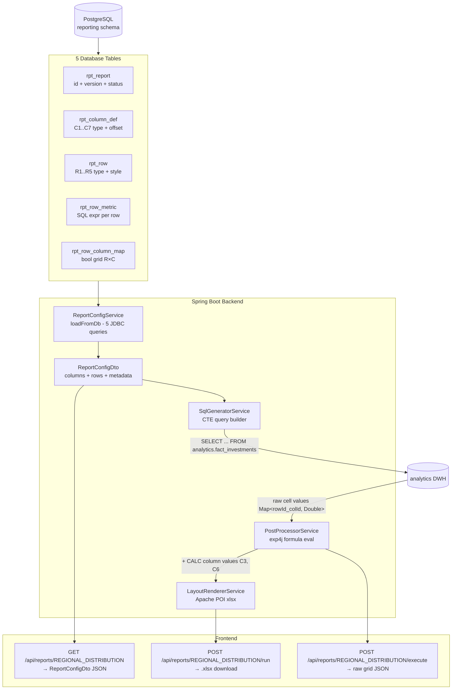

# End-to-End Walkthrough: `REGIONAL_DISTRIBUTION` Report

This document traces how the **Regional Distribution** report lives in the database, moves through the Spring Boot backend, and is finally serialized as JSON for the frontend.

---

## 1. What Is This Report?

`REGIONAL_DISTRIBUTION` is a financial investment report that aggregates **Total AUM**, **Avg Position Size**, **Investment Count**, and **Unique Tickers** from the `analytics.fact_investments` DWH table across seven time columns: MTD current, MTD prior, MoM %, YTD current, YTD prior year, YoY growth %, and a 3-month rolling period.

---

## 2. Database Layer — 5 Tables That Define a Report

Every report in the engine is fully described by five tables in the `reporting` schema. Below is the exact seed data for `REGIONAL_DISTRIBUTION`.

### 2.1 `reporting.rpt_report` — The Header Row

One row per report version. Stores identity, lifecycle status, and optional filter templates.

```sql
INSERT INTO reporting.rpt_report (
  report_id,             -- 'REGIONAL_DISTRIBUTION'
  name,                  -- 'Regional Distribution'
  description,
  explore_id,            -- NULL  (bypasses semantic layer)
  version,               -- 1
  status,                -- 'published'
  granularity,           -- NULL  (no dimensional grouping)
  timeframe_start,       -- NULL
  timeframe_end,         -- NULL
  timeframe_today,       -- NULL
  quick_filters,         -- NULL
  general_filters        -- NULL
)
VALUES ('REGIONAL_DISTRIBUTION', 'Regional Distribution', 'Regional Distribution',
        NULL, 1, 'published', NULL, NULL, NULL, NULL, NULL, NULL);
```

> [!NOTE]
> `explore_id = NULL` is the key design decision: this report binds **directly** to physical DWH tables, bypassing the `sem_*` semantic tables entirely.

---

### 2.2 `reporting.rpt_column_def` — 7 Column Definitions

Each column defines one "time slice". Columns are typed as `MTD`, `YTD`, `ROLLING`, or `CALC`.

| col_id | label | col_type | period_offset | rolling_n | formula_expr | display_order |
|:---:|:---|:---:|:---:|:---:|:---|:---:|
| C1 | Current Month | `MTD` | 0 | — | — | 1 |
| C2 | Prior Month | `MTD` | -1 | — | — | 2 |
| **C3** | **MoM %** | **`CALC`** | 0 | — | `(C1-C2)/C2` | 3 |
| C4 | YTD Current | `YTD` | 0 | — | — | 4 |
| C5 | YTD Prior Year | `YTD` | -12 | — | — | 5 |
| **C6** | **YoY Growth** | **`CALC`** | 0 | — | `(C4-C5)/C5` | 6 |
| C7 | 3-Mo Rolling | `ROLLING` | 0 | 3 | — | 7 |

- **`MTD` with `period_offset = 0`** → current month-to-date window.
- **`MTD` with `period_offset = -1`** → the *prior* month window (shifted back one calendar month).
- **`YTD` with `period_offset = -12`** → year-to-date window shifted back 12 months, giving prior-year YTD.
- **`CALC` columns** hold no SQL; their `formula_expr` is evaluated post-query by `PostProcessorService` using `exp4j`.
- **`ROLLING` with `rolling_n = 3`** → a trailing 3-month window.

```sql
-- SQL data column example
INSERT INTO reporting.rpt_column_def VALUES
  ('REGIONAL_DISTRIBUTION', 'C1', 'Current Month', 'MTD',   0,  NULL, '',           1),
  ('REGIONAL_DISTRIBUTION', 'C2', 'Prior Month',   'MTD',  -1,  NULL, '',           2),
  ('REGIONAL_DISTRIBUTION', 'C3', 'MoM %',         'CALC',  0,  NULL, '(C1-C2)/C2',3),
  ('REGIONAL_DISTRIBUTION', 'C4', 'YTD Current',   'YTD',   0,  NULL, '',           4),
  ('REGIONAL_DISTRIBUTION', 'C5', 'YTD Prior Year','YTD', -12,  NULL, '',           5),
  ('REGIONAL_DISTRIBUTION', 'C6', 'YoY Growth',    'CALC',  0,  NULL, '(C4-C5)/C5',6),
  ('REGIONAL_DISTRIBUTION', 'C7', '3-Mo Rolling',  'ROLLING',0, 3,   '',           7);
```

---

### 2.3 `reporting.rpt_row` — 5 Row Definitions

Rows define the vertical layout. Row types are `section`, `data`, `calc`, or `blank`.

| row_id | parent | label | row_type | indent | style_id |
|:---:|:---:|:---|:---:|:---:|:---:|
| R1 | — | Investments Overview | `section` | 0 | 1 (Section) |
| R2 | R1 | Total AUM | `data` | 1 | 3 (Bold) |
| R3 | R1 | Avg Position Size | `data` | 1 | 4 (Normal) |
| R4 | R1 | Investment Count | `data` | 1 | 4 (Normal) |
| R5 | R1 | Unique Tickers | `data` | 1 | 4 (Normal) |

```sql
INSERT INTO reporting.rpt_row (row_id, report_id, parent_row_id, label, row_type, display_order, indent_level, style_id) VALUES
  ('R1', 'REGIONAL_DISTRIBUTION', NULL, 'Investments Overview', 'section', 13, 0, 1),
  ('R2', 'REGIONAL_DISTRIBUTION', 'R1', 'Total AUM',           'data',    14, 1, 3),
  ('R3', 'REGIONAL_DISTRIBUTION', 'R1', 'Avg Position Size',   'data',    15, 1, 4),
  ('R4', 'REGIONAL_DISTRIBUTION', 'R1', 'Investment Count',    'data',    16, 1, 4),
  ('R5', 'REGIONAL_DISTRIBUTION', 'R1', 'Unique Tickers',      'data',    17, 1, 4);
```

---

### 2.4 `reporting.rpt_row_metric` — SQL Expressions for `data` Rows

Each `data` row has exactly one metric entry. The `sql_expr` is the raw aggregation SQL. The `measure_definition` stores a JSON blob for structured inspection.

| row_id | sql_expr | measure_definition (JSON) |
|:---:|:---|:---|
| R2 | `SUM(analytics.fact_investments.current_value)` | `{"mode":"raw","table":"analytics.fact_investments","rawSql":"SUM(...)"}` |
| R3 | `AVG(analytics.fact_investments.current_value)` | `{"mode":"raw","table":"analytics.fact_investments","rawSql":"AVG(...)"}` |
| R4 | `COUNT(DISTINCT analytics.fact_investments.id)` | `{"mode":"raw","table":"analytics.fact_investments","rawSql":"COUNT(DISTINCT ...)"}` |
| R5 | `COUNT(DISTINCT analytics.fact_investments.ticker_symbol)` | `{"mode":"raw","table":"analytics.fact_investments","rawSql":"COUNT(DISTINCT ...)"}` |

> [!IMPORTANT]
> The `table` field inside the JSON (`analytics.fact_investments`) is critical — `SqlGeneratorService` uses it to discover which DWH fact table to query, build the CTE name, and route joins via `SchemaGraphRouter`.

---

### 2.5 `reporting.rpt_row_column_map` — The Enablement Grid

This is a boolean grid. Each `(row_id, col_id)` pair declares whether a cell is **active** (compiled and rendered) or **disabled** (left blank).

| | C1 (MTD) | C2 (MTD-1) | C3 (MoM%) | C4 (YTD) | C5 (YTD-12) | C6 (YoY%) | C7 (Roll) |
|:---|:---:|:---:|:---:|:---:|:---:|:---:|:---:|
| R1 Section | ✅ | ✅ | ❌ | ✅ | ✅ | ❌ | ❌ |
| R2 Total AUM | ✅ | ✅ | ✅ | ✅ | ✅ | ✅ | ❌ |
| R3 Avg Size | ✅ | ✅ | ✅ | ✅ | ✅ | ✅ | ❌ |
| R4 Count | ✅ | ✅ | ✅ | ✅ | ✅ | ✅ | ❌ |
| R5 Tickers | ✅ | ✅ | ✅ | ✅ | ✅ | ✅ | ❌ |

> [!NOTE]
> C7 (3-Mo Rolling) is disabled for all rows in this version — it is defined in the column schema but not currently used. C3 and C6 (CALC columns) are disabled on the section header R1 since section rows render no numeric values.

---

## 3. Java Domain Model

The five tables map to five JPA entities in [`com.reporting.domain`](file:///Users/mariusdruga/Workspace/reportingengine_backend/src/main/java/com/reporting/domain):

```
Report              ←→  rpt_report          (PK: report_id + version)
  └─ ColumnDef[]    ←→  rpt_column_def      (PK: column_def_id, FK: report_id+version)
  └─ ReportRow[]    ←→  rpt_row             (PK: row_id+report_id+version)
        └─ RowMetric    ←→  rpt_row_metric  (FK: report_id+version+row_id)
        └─ RowFormula   ←→  rpt_row_formula (FK: report_id+version+row_id)
  └─ RowColumnMap[] ←→  rpt_row_column_map  (PK: mapping_id, composite unique: report+version+row+col)
```

Key entity fields:

| Entity | Key Fields |
|:---|:---|
| [Report.java](file:///Users/mariusdruga/Workspace/reportingengine_backend/src/main/java/com/reporting/domain/Report.java) | `reportId`, `version`, `name`, `status`, `granularity`, `quickFilters`, `generalFilters` |
| [ColumnDef.java](file:///Users/mariusdruga/Workspace/reportingengine_backend/src/main/java/com/reporting/domain/ColumnDef.java) | `colId`, `colType`, `periodOffset`, `rollingN`, `rollingGrain`, `formulaExpr`, `displayOrder` |
| [ReportRow.java](file:///Users/mariusdruga/Workspace/reportingengine_backend/src/main/java/com/reporting/domain/ReportRow.java) | `rowId`, `parentRowId`, `label`, `rowType`, `indentLevel`, `styleId`, `filterExpr` |
| [RowMetric.java](file:///Users/mariusdruga/Workspace/reportingengine_backend/src/main/java/com/reporting/domain/RowMetric.java) | `rowId`, `sqlExpr`, `measureDefinition` (JSON blob) |
| [RowColumnMap.java](file:///Users/mariusdruga/Workspace/reportingengine_backend/src/main/java/com/reporting/domain/RowColumnMap.java) | `rowId`, `colId`, `isEnabled` |

---

## 4. Config Loading Pipeline (`ReportConfigService`)

When the frontend calls `GET /api/reports/REGIONAL_DISTRIBUTION`, [`ReportConfigService.loadFromDb()`](file:///Users/mariusdruga/Workspace/reportingengine_backend/src/main/java/com/reporting/service/ReportConfigService.java#L52-L249) executes **5 direct JDBC queries** (no JPA hydration overhead) and assembles the `ReportConfigDto`:

```
Step 1: Load rpt_report header            → Report entity
Step 2: SELECT from rpt_column_def        → List<ColumnDefDto>
Step 3: SELECT from rpt_row_metric        → Map<rowId, MeasureDefinitionDTO>
Step 4: SELECT from rpt_row_formula       → Map<rowId, formulaExpr>
Step 5: SELECT from rpt_row_column_map    → Map<rowId, Set<activeColIds>>
Step 6: SELECT from rpt_style             → Map<styleId, styleName>
Step 7: SELECT from rpt_row              → List<ReportRowDto> (joined with maps above)
```

The resulting `ReportConfigDto` is the single unified object describing the full report configuration.

---

## 5. DTO Layer — What Gets Serialized to JSON

The API response from `GET /api/reports/REGIONAL_DISTRIBUTION` is a [`ReportConfigDto`](file:///Users/mariusdruga/Workspace/reportingengine_backend/src/main/java/com/reporting/dto/ReportConfigDto.java):

```json
{
  "reportId": "REGIONAL_DISTRIBUTION",
  "name": "Regional Distribution",
  "version": 1,
  "status": "published",
  "granularity": null,
  "exploreId": null,
  "referenceDate": "2026-06-16",
  "timeframeStart": null,
  "timeframeEnd": null,
  "timeframeToday": null,
  "quickFilters": null,
  "generalFilters": null,

  "columns": [
    { "colId": "C1", "label": "Current Month",  "colType": "MTD",     "periodOffset": 0,   "rollingN": null, "rollingGrain": null, "formulaExpr": "",            "displayOrder": 1 },
    { "colId": "C2", "label": "Prior Month",    "colType": "MTD",     "periodOffset": -1,  "rollingN": null, "rollingGrain": null, "formulaExpr": "",            "displayOrder": 2 },
    { "colId": "C3", "label": "MoM %",          "colType": "CALC",    "periodOffset": 0,   "rollingN": null, "rollingGrain": null, "formulaExpr": "(C1-C2)/C2", "displayOrder": 3 },
    { "colId": "C4", "label": "YTD Current",    "colType": "YTD",     "periodOffset": 0,   "rollingN": null, "rollingGrain": null, "formulaExpr": "",            "displayOrder": 4 },
    { "colId": "C5", "label": "YTD Prior Year", "colType": "YTD",     "periodOffset": -12, "rollingN": null, "rollingGrain": null, "formulaExpr": "",            "displayOrder": 5 },
    { "colId": "C6", "label": "YoY Growth",     "colType": "CALC",    "periodOffset": 0,   "rollingN": null, "rollingGrain": null, "formulaExpr": "(C4-C5)/C5", "displayOrder": 6 },
    { "colId": "C7", "label": "3-Mo Rolling",   "colType": "ROLLING", "periodOffset": 0,   "rollingN": 3,    "rollingGrain": null, "formulaExpr": "",            "displayOrder": 7 }
  ],

  "rows": [
    {
      "rowId": "R1",
      "reportId": "REGIONAL_DISTRIBUTION",
      "label": "Investments Overview",
      "rowType": "section",
      "source": null,
      "parentRowId": null,
      "style": "section",
      "indentLevel": 0,
      "displayOrder": 1,
      "activeCols": ["C1", "C2", "C4", "C5"],
      "filterExpr": null
    },
    {
      "rowId": "R2",
      "reportId": "REGIONAL_DISTRIBUTION",
      "label": "Total AUM",
      "rowType": "data",
      "source": {
        "mode": "raw",
        "aggregation": null,
        "targetColumn": null,
        "table": "analytics.fact_investments",
        "rawSql": "SUM(analytics.fact_investments.current_value)"
      },
      "parentRowId": "R1",
      "style": "bold",
      "indentLevel": 1,
      "displayOrder": 2,
      "activeCols": ["C1", "C2", "C3", "C4", "C5", "C6"],
      "filterExpr": null
    },
    {
      "rowId": "R3",
      "label": "Avg Position Size",
      "rowType": "data",
      "source": {
        "mode": "raw",
        "table": "analytics.fact_investments",
        "rawSql": "AVG(analytics.fact_investments.current_value)"
      },
      "activeCols": ["C1", "C2", "C3", "C4", "C5", "C6"]
    },
    {
      "rowId": "R4",
      "label": "Investment Count",
      "rowType": "data",
      "source": {
        "mode": "raw",
        "table": "analytics.fact_investments",
        "rawSql": "COUNT(DISTINCT analytics.fact_investments.id)"
      },
      "activeCols": ["C1", "C2", "C3", "C4", "C5", "C6"]
    },
    {
      "rowId": "R5",
      "label": "Unique Tickers",
      "rowType": "data",
      "source": {
        "mode": "raw",
        "table": "analytics.fact_investments",
        "rawSql": "COUNT(DISTINCT analytics.fact_investments.ticker_symbol)"
      },
      "activeCols": ["C1", "C2", "C3", "C4", "C5", "C6"]
    }
  ]
}
```

> [!TIP]
> The `source` object on each `data` row is a [`MeasureDefinitionDTO`](file:///Users/mariusdruga/Workspace/reportingengine_backend/src/main/java/com/reporting/dto/MeasureDefinitionDTO.java). When `mode == "raw"`, the frontend passes it straight back to the engine; when `mode == "visual"`, the frontend shows column-picker UI and the engine assembles `AGG(column)` from `aggregation` + `targetColumn`.

---

## 6. Execution Pipeline — What Happens on `POST /api/reports/REGIONAL_DISTRIBUTION/run`

```
ReportRunnerService.run()
  │
  ├─ 1. ReportConfigService.loadFromDb()     → ReportConfigDto
  │
  ├─ 2. SqlGeneratorService.generate()       → SQL string (CTE query)
  │       │
  │       ├─ Discover unique source tables: {analytics.fact_investments}
  │       ├─ For each SQL column (C1, C2, C4, C5, C7):
  │       │     resolve date boundaries from DateUtils
  │       │     inject CASE WHEN date_key BETWEEN ... for each data row
  │       └─ Build CTE: cte_fact_investments
  │
  ├─ 3. Execute SQL against DWH
  │       → Returns Map<"R2_C1", 12500000.0>, Map<"R3_C1", 250000.0>, ...
  │
  ├─ 4. PostProcessorService.evaluate()      → Fill CALC cells
  │       ├─ C3 (MoM%): (R2_C1 - R2_C2) / R2_C2 per row
  │       └─ C6 (YoY%): (R2_C4 - R2_C5) / R2_C5 per row
  │
  └─ 5. LayoutRendererService.render()       → .xlsx file download
          Apply styles, fonts, borders, number formats via Apache POI
```

### Sample Generated SQL (reference date `2025-12-31`)

```sql
WITH cte_fact_investments AS (
  SELECT
    CAST(NULL AS VARCHAR) AS granularity_col,

    -- R2 × C1: Total AUM, Current Month
    CAST(SUM(CASE WHEN fi.date_key >= '2025-12-01' AND fi.date_key <= '2025-12-31'
                  THEN fi.current_value ELSE 0 END) AS DOUBLE PRECISION) AS val_r2_c1,

    -- R2 × C2: Total AUM, Prior Month
    CAST(SUM(CASE WHEN fi.date_key >= '2025-11-01' AND fi.date_key <= '2025-11-30'
                  THEN fi.current_value ELSE 0 END) AS DOUBLE PRECISION) AS val_r2_c2,

    -- R2 × C4: Total AUM, YTD Current
    CAST(SUM(CASE WHEN fi.date_key >= '2025-01-01' AND fi.date_key <= '2025-12-31'
                  THEN fi.current_value ELSE 0 END) AS DOUBLE PRECISION) AS val_r2_c4,

    -- R2 × C5: Total AUM, YTD Prior Year
    CAST(SUM(CASE WHEN fi.date_key >= '2024-01-01' AND fi.date_key <= '2024-12-31'
                  THEN fi.current_value ELSE 0 END) AS DOUBLE PRECISION) AS val_r2_c5,

    -- R3 × C1: Avg Position Size, Current Month
    CAST(AVG(CASE WHEN fi.date_key >= '2025-12-01' AND fi.date_key <= '2025-12-31'
                  THEN fi.current_value END) AS DOUBLE PRECISION) AS val_r3_c1,

    -- ... etc for R3, R4, R5 × C1, C2, C4, C5

    -- R4: COUNT DISTINCT uses sub-select strategy
    CAST(COUNT(DISTINCT CASE WHEN fi.date_key >= '2025-12-01' AND fi.date_key <= '2025-12-31'
                              THEN fi.id END) AS DOUBLE PRECISION) AS val_r4_c1,

    CAST(COUNT(DISTINCT CASE WHEN fi.date_key >= '2025-12-01' AND fi.date_key <= '2025-12-31'
                              THEN fi.ticker_symbol END) AS DOUBLE PRECISION) AS val_r5_c1

  FROM analytics.fact_investments fi
  GROUP BY 1
)
SELECT 'R2' AS row_id, 'C1' AS col_id, val_r2_c1 AS val FROM cte_fact_investments
UNION ALL
SELECT 'R2', 'C2', val_r2_c2 FROM cte_fact_investments
-- ... all enabled (row, col) pairs as UNION ALL rows
```

> [!NOTE]
> C3 and C6 (CALC columns) are **not queried**. Their values are computed entirely in Java by `PostProcessorService` after the SQL result comes back.

---

## 7. Data Flow Diagram



---

## 8. Frontend-Facing API Summary

| Endpoint | Method | Purpose | Response |
|:---|:---:|:---|:---|
| `/api/reports` | GET | Catalog list, one row per report (latest version) | `List<Report>` (header only) |
| `/api/reports/REGIONAL_DISTRIBUTION` | GET | Full config: columns, rows, metric sources, active grid | `ReportConfigDto` JSON |
| `/api/reports/REGIONAL_DISTRIBUTION?version=1&date=2025-12-31` | GET | Pinned version with reference date | `ReportConfigDto` JSON |
| `/api/reports/REGIONAL_DISTRIBUTION/run` | POST | Execute & download | `.xlsx` file stream |
| `/api/reports/REGIONAL_DISTRIBUTION/execute` | POST | Execute & get raw cell grid | `Map<rowId, Map<colId, Double>>` |
| `/api/reports/REGIONAL_DISTRIBUTION/version/list` | GET | All versions with status | `List<Report>` |

---

## 9. Key Design Principles Illustrated by This Report

| Principle | How It Applies |
|:---|:---|
| **Physical binding (no semantic layer)** | `explore_id = NULL`; rows bind directly to `analytics.fact_investments` via `sql_expr` |
| **Cascade overwrite on save** | A `PUT /api/reports/REGIONAL_DISTRIBUTION` deletes all child rows for that version before re-inserting |
| **Direct JDBC hot path** | `loadFromDb()` uses 5 raw `JdbcTemplate` queries — no Hibernate entity hydration |
| **CALC columns post-processed** | C3 (`MoM %`) and C6 (`YoY %`) never appear in the SQL query; they are computed in Java by `PostProcessorService` using `exp4j` |
| **Grid enablement map** | `rpt_row_column_map` is the source of truth for which cells render; `section` rows and C7 are disabled, skipping unnecessary query compilation |
| **Version lifecycle** | Status `published` → any `PUT` to modify throws `IllegalStateException`; must fork first via `POST /version/fork` |
