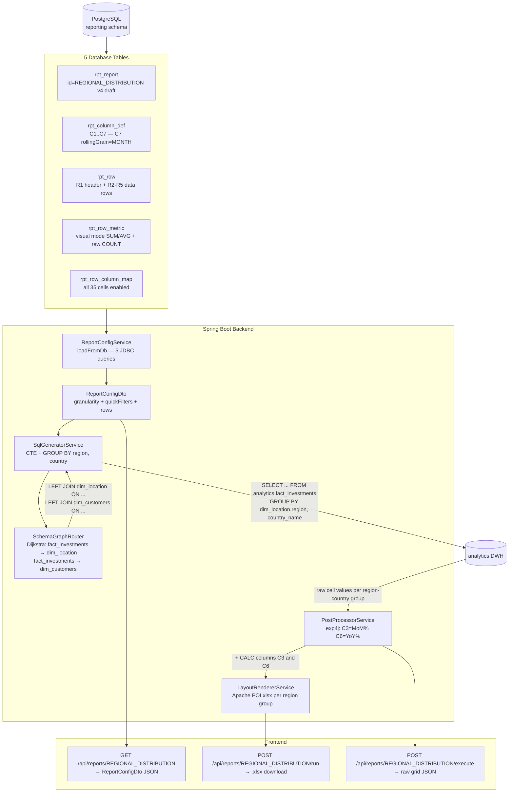

# End-to-End Walkthrough: `REGIONAL_DISTRIBUTION` Report

This document traces how the **Regional Distribution** report lives in the database, moves through the Spring Boot backend, and is finally serialized as JSON for the frontend.

> [!NOTE]
> All data below reflects the **live configuration fetched from the API** (`GET /api/reports/REGIONAL_DISTRIBUTION`) as of 2026-06-16. The current active version is **v4 (draft)**, which has been significantly evolved from the original v1 seed.

---

## 1. What Is This Report?

`REGIONAL_DISTRIBUTION` aggregates investment portfolio metrics — **Total AUM**, **Avg Position Size**, **Investment Count**, and **Unique Tickers** — from `analytics.fact_investments`, broken down by **region and country** (`dim_location`). It spans seven time columns (MTD, MTD prior, MoM%, YTD, YTD prior year, YoY%, 3-month rolling) and applies dimensional filters from `dim_customers`.

---

## 2. Report Header — Current Live State

| Field | Value |
|:---|:---|
| `reportId` | `REGIONAL_DISTRIBUTION` |
| `name` | Regional Distribution |
| `version` | **4** |
| `status` | **draft** |
| `exploreId` | **1** (semantic layer join routing active) |
| `granularity` | **`dim_location.region, dim_location.country_name`** |
| `timeframeStart` | `2024-06-01` |
| `timeframeEnd` | `2026-06-09` |
| `timeframeToday` | `false` |

> [!IMPORTANT]
> Unlike the original v1 seed (`explore_id = NULL`), version 4 uses `exploreId = 1`. This activates the **semantic join router** (`SchemaGraphRouter`): when the SQL generator discovers that `granularity` references `dim_location`, it resolves the LEFT JOIN path from `fact_investments` to `dim_location` via the `meta_relationship` catalog graph.

---

## 3. Granularity — Dimensional Breakdown

The `granularity` field `"dim_location.region,dim_location.country_name"` tells the SQL generator to **GROUP BY** two dimension columns, producing one output row per unique `(region, country_name)` combination instead of a single aggregate.

At query-compilation time (`SqlGeneratorService`):
1. The table `dim_location` is parsed from the granularity string.
2. `SchemaGraphRouter` performs a Dijkstra BFS from `analytics.fact_investments` → `analytics.dim_location`, resolving the JOIN chain via `meta_relationship`.
3. The generated CTE includes a `GROUP BY dim_location.region, dim_location.country_name` clause, and both columns appear as output columns alongside the metric values.

---

## 4. Column Definitions (7 columns, all enabled)

| col_id | label | col_type | period_offset | rolling_n | rolling_grain | formula_expr |
|:---:|:---|:---:|:---:|:---:|:---:|:---|
| C1 | Current Month | `MTD` | 0 | — | — | — |
| C2 | Prior Month | `MTD` | -1 | — | — | — |
| **C3** | **MoM %** | **`CALC`** | 0 | — | — | `(C1-C2)/C2` |
| C4 | YTD Current | `YTD` | 0 | — | — | — |
| C5 | YTD Prior Year | `YTD` | -12 | — | — | — |
| **C6** | **YoY Growth** | **`CALC`** | 0 | — | — | `(C4-C5)/C5` |
| C7 | 3-Mo Rolling | `ROLLING` | 0 | 3 | **`MONTH`** | — |

> [!NOTE]
> **C7 now has `rollingGrain = "MONTH"`** (populated by migration 011/013). All 7 columns are active on all rows in v4 — C7 is no longer disabled. `CALC` columns (C3, C6) are never queried; their values are computed post-SQL by `PostProcessorService` via `exp4j`.

---

## 5. Row Definitions & Metrics

### 5.1 Row Layout

| row_id | label | row_type | indent | style | parent |
|:---:|:---|:---:|:---:|:---:|:---:|
| R1 | Investments Overview | `section` | 0 | `header` | — |
| R2 | Total AUM | `data` | 1 | `total` | R1 |
| R3 | Avg Position Size | `data` | 1 | `normal` | R1 |
| R4 | Investment Count | `data` | 1 | `normal` | R1 |
| R5 | Unique Tickers | `data` | 1 | `normal` | R1 |

### 5.2 Metric Sources (MeasureDefinitionDTO)

Each `data` row carries a `source` object describing how the SQL aggregation is built. In v4 most rows use **visual mode** (UI column-picker), while R5 uses **raw SQL**:

| row_id | mode | aggregation | targetColumn | rawSql |
|:---:|:---:|:---:|:---:|:---|
| R2 Total AUM | `visual` | `SUM` | `current_value` | — |
| R3 Avg Position Size | `visual` | `AVG` | `quantity` | — |
| R4 Investment Count | `visual` | `AVG` | `quantity` | — |
| R5 Unique Tickers | `raw` | — | — | `COUNT(ticker_symbol)` |

> [!TIP]
> When `mode == "visual"`, `SqlGeneratorService` assembles the SQL as `AGG(table.column)` at compile time. When `mode == "raw"`, the expression is passed through verbatim into the `CASE WHEN` aggregation block.

### 5.3 Per-Row Filter Expressions

Rows R2, R4, and R5 carry `filterExpr` — a JSON rule-tree that gets compiled into additional `WHERE` conditions scoped to that specific row's aggregation:

| row_id | filterExpr summary |
|:---:|:---|
| R2 | `quantity IS NOT NULL` |
| R4 | `hier_id IN (1,2) AND hier_id IS NOT 3` + nested OR: `location_id IN (1,2,3,4)` AND `ticker_symbol IN (AAPL, AMZN, GOOGL, META, MSFT)` |
| R5 | `ticker_symbol IS NOT NULL` |

### 5.4 Cell Enablement Grid

In v4 **all columns are enabled for all rows**:

| | C1 | C2 | C3 (CALC) | C4 | C5 | C6 (CALC) | C7 (ROLL) |
|:---|:---:|:---:|:---:|:---:|:---:|:---:|:---:|
| R1 Section | ✅ | ✅ | ✅ | ✅ | ✅ | ✅ | ✅ |
| R2 Total AUM | ✅ | ✅ | ✅ | ✅ | ✅ | ✅ | ✅ |
| R3 Avg Size | ✅ | ✅ | ✅ | ✅ | ✅ | ✅ | ✅ |
| R4 Count | ✅ | ✅ | ✅ | ✅ | ✅ | ✅ | ✅ |
| R5 Tickers | ✅ | ✅ | ✅ | ✅ | ✅ | ✅ | ✅ |

---

## 6. Filters

### Quick Filters (runtime-injectable, pre-defined values)

Two quick filters are configured on `dim_customers`:

| dimTable | attribute | operator | value | conjunction |
|:---|:---|:---:|:---:|:---:|
| `dim_customers` | `country_code` | `=` | `US` | `OR` |
| `dim_customers` | `segment` | `=` | `Wealth` | `AND` |

These filters trigger a JOIN from `fact_investments` → `dim_customers` via `SchemaGraphRouter` and inject a `WHERE dim_customers.country_code = 'US' AND dim_customers.segment = 'Wealth'` clause.

### General Filters

Currently `[]` (empty — no general free-text SQL conditions applied).

---

## 7. API JSON Shape (`GET /api/reports/REGIONAL_DISTRIBUTION`)

The full response shape from `ReportConfigDto`:

```json
{
  "reportId": "REGIONAL_DISTRIBUTION",
  "name": "Regional Distribution",
  "version": 4,
  "status": "draft",
  "exploreId": 1,
  "granularity": "dim_location.region,dim_location.country_name",
  "timeframeStart": "2024-06-01",
  "timeframeEnd": "2026-06-09",
  "timeframeToday": false,
  "referenceDate": "2026-06-16",
  "quickFilters": "[{\"dimTable\":\"dim_customers\",\"attribute\":\"country_code\",\"operator\":\"=\",\"value\":\"US\",\"conjunction\":\"OR\"}, {\"dimTable\":\"dim_customers\",\"attribute\":\"segment\",\"operator\":\"=\",\"value\":\"Wealth\",\"conjunction\":\"AND\"}]",
  "generalFilters": "[]",

  "columns": [
    { "colId": "C1", "label": "Current Month",  "colType": "MTD",     "periodOffset": 0,   "rollingN": null, "rollingGrain": null,    "formulaExpr": "" },
    { "colId": "C2", "label": "Prior Month",    "colType": "MTD",     "periodOffset": -1,  "rollingN": null, "rollingGrain": null,    "formulaExpr": "" },
    { "colId": "C3", "label": "MoM %",          "colType": "CALC",    "periodOffset": 0,   "rollingN": null, "rollingGrain": null,    "formulaExpr": "(C1-C2)/C2" },
    { "colId": "C4", "label": "YTD Current",    "colType": "YTD",     "periodOffset": 0,   "rollingN": null, "rollingGrain": null,    "formulaExpr": "" },
    { "colId": "C5", "label": "YTD Prior Year", "colType": "YTD",     "periodOffset": -12, "rollingN": null, "rollingGrain": null,    "formulaExpr": "" },
    { "colId": "C6", "label": "YoY Growth",     "colType": "CALC",    "periodOffset": 0,   "rollingN": null, "rollingGrain": null,    "formulaExpr": "(C4-C5)/C5" },
    { "colId": "C7", "label": "3-Mo Rolling",   "colType": "ROLLING", "periodOffset": 0,   "rollingN": 3,    "rollingGrain": "MONTH", "formulaExpr": "" }
  ],

  "rows": [
    {
      "rowId": "R1", "label": "Investments Overview", "rowType": "section",
      "style": "header", "indentLevel": 0, "parentRowId": null, "source": null,
      "activeCols": ["C1","C2","C3","C4","C5","C6","C7"], "filterExpr": null
    },
    {
      "rowId": "R2", "label": "Total AUM", "rowType": "data",
      "style": "total", "indentLevel": 1, "parentRowId": "R1",
      "source": { "mode": "visual", "aggregation": "SUM", "targetColumn": "current_value", "sourceTable": "analytics.fact_investments" },
      "activeCols": ["C1","C2","C3","C4","C5","C6","C7"],
      "filterExpr": "{\"rules\":[{\"columnName\":\"quantity\",\"operator\":\"is not null\"}]}"
    },
    {
      "rowId": "R3", "label": "Avg Position Size", "rowType": "data",
      "style": "normal", "indentLevel": 1, "parentRowId": "R1",
      "source": { "mode": "visual", "aggregation": "AVG", "targetColumn": "quantity", "sourceTable": "analytics.fact_investments" },
      "activeCols": ["C1","C2","C3","C4","C5","C6","C7"], "filterExpr": null
    },
    {
      "rowId": "R4", "label": "Investment Count", "rowType": "data",
      "style": "normal", "indentLevel": 1, "parentRowId": "R1",
      "source": { "mode": "visual", "aggregation": "AVG", "targetColumn": "quantity", "sourceTable": "analytics.fact_investments" },
      "activeCols": ["C1","C2","C3","C4","C5","C6","C7"],
      "filterExpr": "{\"rules\":[{\"columnName\":\"hier_id\",\"operator\":\"in list\",\"value\":[\"1\",\"2\"]},{\"columnName\":\"hier_id\",\"operator\":\"is not\",\"value\":[\"3\"]}], \"childGroups\":[{\"rules\":[{\"columnName\":\"location_id\",\"operator\":\"=\",\"value\":[\"1\",\"2\",\"3\",\"4\"]}]}]}"
    },
    {
      "rowId": "R5", "label": "Unique Tickers", "rowType": "data",
      "style": "normal", "indentLevel": 1, "parentRowId": "R1",
      "source": { "mode": "raw", "rawSql": "COUNT(ticker_symbol)", "sourceTable": "analytics.fact_investments" },
      "activeCols": ["C1","C2","C3","C4","C5","C6","C7"],
      "filterExpr": "{\"rules\":[{\"columnName\":\"ticker_symbol\",\"operator\":\"is not null\"}]}"
    }
  ]
}
```

---

## 8. Execution Pipeline

```
POST /api/reports/REGIONAL_DISTRIBUTION/run
  │
  ├─ 1. ReportConfigService.loadFromDb()
  │       → ReportConfigDto (v4, granularity=dim_location.region+country_name)
  │
  ├─ 2. SqlGeneratorService.generate()
  │       ├─ Parse granularity → ["dim_location.region", "dim_location.country_name"]
  │       ├─ SchemaGraphRouter: fact_investments → dim_location (LEFT JOIN via meta_relationship)
  │       ├─ SchemaGraphRouter: fact_investments → dim_customers (LEFT JOIN for quickFilters)
  │       ├─ For each SQL column (C1, C2, C4, C5, C7):
  │       │     DateUtils resolves date boundaries from reference date
  │       │     Build CASE WHEN date_key BETWEEN ... per row metric
  │       │     Inject per-row filterExpr WHERE conditions
  │       └─ GROUP BY dim_location.region, dim_location.country_name
  │
  ├─ 3. Execute CTE query against analytics DWH
  │       → Map<"R2_C1", [{"region":"EMEA","country":"RO","val":1250000.0}, ...]>
  │
  ├─ 4. PostProcessorService.evaluate()
  │       ├─ C3 = (C1 - C2) / C2   per row × per granularity group
  │       └─ C6 = (C4 - C5) / C5   per row × per granularity group
  │
  └─ 5. LayoutRendererService.render()
          → .xlsx with one data section per (region, country_name) group
```

---

## 9. Data Flow Diagram



---

## 10. Frontend-Facing API Summary

| Endpoint | Method | Purpose | Response |
|:---|:---:|:---|:---|
| `/api/reports` | GET | Catalog — latest version per report | `List<Report>` header |
| `/api/reports/REGIONAL_DISTRIBUTION` | GET | Full config: columns, rows, granularity, filters | `ReportConfigDto` JSON |
| `/api/reports/REGIONAL_DISTRIBUTION?version=1` | GET | Pinned original v1 seed | `ReportConfigDto` JSON |
| `/api/reports/REGIONAL_DISTRIBUTION/run` | POST | Execute & download | `.xlsx` file stream |
| `/api/reports/REGIONAL_DISTRIBUTION/execute` | POST | Execute & get raw cell grid | `Map<rowId, Map<colId, Double>>` |
| `/api/reports/REGIONAL_DISTRIBUTION/version/list` | GET | All versions with status | `List<Report>` |

---

## 11. Key Design Principles Illustrated by This Report

| Principle | How It Applies in v4 |
|:---|:---|
| **Dimensional grouping via granularity** | `granularity = "dim_location.region,dim_location.country_name"` → CTE groups by two dim columns, producing a row per region/country pair |
| **Catalog-driven join routing** | `exploreId = 1` + `SchemaGraphRouter` resolves `fact_investments → dim_location` and `fact_investments → dim_customers` at runtime via `meta_relationship` graph |
| **Dual metric modes** | R2–R4 use `visual` mode (UI-picked aggregation + column); R5 uses `raw` mode (free-text SQL pass-through) |
| **Per-row filter expressions** | R2, R4, R5 each carry a JSON rule-tree `filterExpr` compiled into row-scoped `WHERE` conditions inside the CTE |
| **Quick filters as runtime parameters** | Two `dim_customers` quick filters (`country_code = US`, `segment = Wealth`) inject a JOIN + WHERE without modifying the report definition |
| **CALC columns post-processed** | C3 (MoM%) and C6 (YoY%) are absent from the SQL; computed in Java by `PostProcessorService` per granularity group |
| **Rolling grain explicit** | C7 `rollingGrain = "MONTH"` explicitly drives `DateUtils` to calculate a trailing 3-month window boundary |
| **Version lifecycle** | v1 was `published`; current edits live in v4 `draft` — a `PUT` on a `published` version throws `IllegalStateException` |
